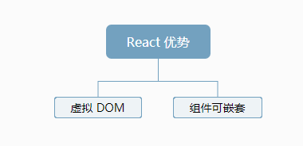

https://doc.react-china.org/

# # 概述

React 是 Facebook 在2013年推出的一个用来构建UI（用户界面）的 JavaScript 库。

React主要用于构建UI，很多人认为 React 是 MVC 中的 V（视图）。

React 起源于 Facebook 的内部项目，用来架设 Instagram 的网站，并于 2013 年 5 月开源。

React 拥有较高的性能，代码逻辑非常简单，越来越多的人已开始关注和使用它。

# # 特点

- **声明式设计** −React采用声明范式，可以轻松描述应用。
- **高效** −React通过对DOM的模拟，最大限度地减少与DOM的交互。
- **灵活** −React可以与已知的库或框架很好地配合。
- **JSX** − JSX 是 JavaScript 语法的扩展。React 开发不一定使用 JSX ，但我们建议使用它。
- **组件** − 通过 React 构建组件，使得代码更加容易得到复用，能够很好的应用在大项目的开发中。
- **单向响应的数据流** − React 实现了单向响应的数据流，从而减少了重复代码，这也是它为什么比传统数据绑定更简单。

# # 优势



**首先**：虚拟 DOM，在 DOM 树的状态需要发生变化时，虚拟 DOM 机制会将同一Event loop前后的 DOM树进行对比，如果两个 DOM 树存在不一样的地方，那么 React 仅仅会针对这些不一样的区域来进行响应的 DOM 修改，从而实现最高效的 DOM 操作和渲染。

比如，我们修改了 DOM 树上一些节点或 UI 组件对应绑定的 state，React 会即刻将其标记为“脏状态”，在一个 Event loop 结束时，React 会计算得出 DOM 树上需要修改的地方及其最终的状态，并仅仅针对这些地方进行一次性的重新渲染。

于是好处显而易见，并非每修改一次组件的 state，就会重新渲染一次，而是在 Event loop 结束后做一次计算，减少冗余的 DOM 操作。另外 React 只针对需要修改的地方来做新的渲染，而非重新渲染整个 DOM 树，自然效率很高。

**其次**：组件可嵌套，而且，可以模版化 —— 其实在 React 里提及的“组件”，常规是一些可封装起来、复用的 UI 模块，可以理解为“带有细粒度UI功能的部分DOM区域”。然后我们可以把这些组件层层嵌套起来使用，当然这样组件间会存在依赖关系。

至于模块化，类似于 ejs 那样可以作为独立的模块被引用到页面上来复用，它可以直接把 UI 组件当作脚本模块那样来使用，完全可以配合 CommonJS、AMD、CMD 等规范来 require 需要的组件模块，并处理好它们的依赖关系。

基于上述的两点，React 很自然的就获得一部分开发者的青睐。不过在这之前得先理清两件事情：

\1. React 是一个纯 View 层，不擅长于和动态数据打交道，因此它不同于，也替代不了常规的框架；

\2. React 很擅长于处理组件化的页面，在页面上搭组件的形式有点像搭积木一样，因此用上React的项目需求常规为界面组件化。

简单点说，React组件应该具有如下特征：

（1）**可组合**（Composeable）：一个组件易于和其它组件一起使用，或者嵌套在另一个组件内部。如果一个组件内部创建了另一个组件，那么说父组件拥有它创建的子组件，通过这个特性，一个复杂的UI可以拆分成多个简单的 UI 组件；

（2）**可重用**（Reusable）：每个组件都是具有独立功能的，它可以被使用在多个UI场景；

（3）**可维护**（Maintainable）：每个小的组件仅仅包含自身的逻辑，更容易被理解和维护；

组件化一直是网页开发的利器，许多开发者最希望能够最大程度的重复使用过去的开发的组件，避免重复造轮子。在 React 中组件就是一切，前端开发可能需要花点时间转变思维，尤其过去我们往往习惯将 HTML 、CSS 和 JavaScript 分离，现在却要把它们都封装在一起。

以下是一般  React Component 书写的主要两种方式：

1. 使用 ES6 的 Class

```react
//  注意组件首字母需要大写
class MyComponent extends React.Component {
	// render 是 Class based 元件唯一必須的方法（method）
	render() {
		return (<div>Hello, World!</div>);
	}
}

// 將 <MyComponent /> 组件插入 id 為 app 的 DOM 元素中
ReactDOM.render(<MyComponent/>, document.getElementById('app'));
```

1. 使用 Functional Component 写法

```react
// 使用箭头函数来设计 Functional Component 让 UI 设计更便捷，避免互相干扰（side effect）
const MyComponent = () => (
	<div>Hello, World!</div>
);

// 將 <MyComponent /> 组件插入 id 為 app 的 DOM 元素中
ReactDOM.render(<MyComponent/>, document.getElementById('app'));
```

# # 引入

引入三个库： react.min.js 、react-dom.min.js 和 babel.min.js：

- **react.min.js** - React 的核心库
- **react-dom.min.js** - 提供与 DOM 相关的功能
- **babel.min.js** - Babel 可以将 ES6 代码转为 ES5 代码，这样我们就能在目前不支持 ES6 浏览器上执行 React 代码。Babel 内嵌了对 JSX 的支持。通过将 Babel 和 babel-sublime 包（package）一同使用可以让源码的语法渲染上升到一个全新的水平。

## 1. 直接下载

点击前往下载：https://github.com/facebook/react/releases

## 2. CDN 引入

```html
<!DOCTYPE html>
<html lang="zh-Hans">
<head>
    <meta charset="UTF-8">
    <meta name="viewport" content="width=device-width, initial-scale=1.0">
    <meta http-equiv="X-UA-Compatible" content="ie=edge">
    <script src="https://unpkg.com/react@16/umd/react.development.js"></script>
    <script src="https://unpkg.com/react-dom@16/umd/react-dom.development.js"></script>
    <script src="https://unpkg.com/babel-standalone@6.15.0/babel.min.js"></script>
    <title>Hello, World!</title>
</head>
<body>
    <div id="app"></div>
    <!-- 在React开发中，使用JSX，跟JavaScript不兼容，在使用JSX的地方，要设置type：text/babel -->
    <!-- babel 是一个转换编译器，ES6转成可以再浏览器中运行的代码-->
    <script type="text/babel">
        // 我们的react
    </script>
</body>
</html>
```

## 3. npm 

```shell
$ npm install react
```

## 4. react 脚手架

create-react-app 是来自于 Facebook，通过该命令我们无需配置就能快速构建 React 开发环境。

create-react-app 自动创建的项目是基于 Webpack + ES6 。

stips 01：执行以下命令创建项目：

```shell
# 全局安装create-react-app
$ npm install -g create-react-app
# 查看版本，如果打印版本号，表示安装成功
$ create-react-app --version
# 创建项目，my-app是项目名
$ create-react-app my-app
$ cd my-app/
# 启动项目
$ npm start
```

> 提示：“Windows” 如果提示不是内部命令，去添加环境变量即可。

## 5. CodePen

https://codepen.io/gaearon/pen/ZpvBNJ


