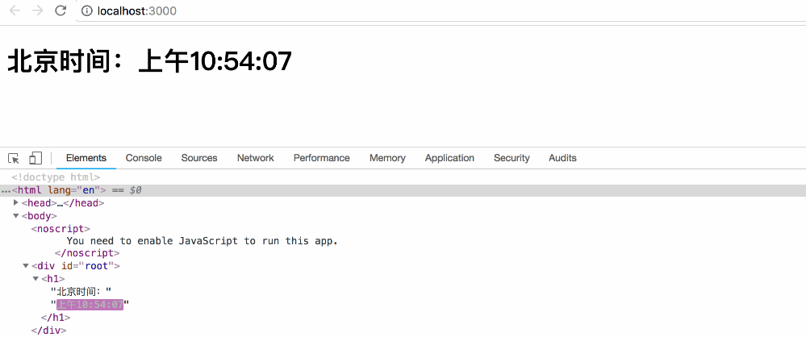

# 一、概述

元素是构成 React 应用的最小单位。

元素用来描述你在屏幕上看到的内容：

```jsx
let element = <h1>Hello, React!</h1>
```

与浏览器的 DOM 元素不同，React 当中的元素事实上是普通的对象，React DOM 可以确保 浏览器 DOM 的数据内容与 React 元素保持一致。

> 注意：你可能会将元素与另一个被熟知的概念——“组件”混淆起来。组件是由元素构成的。

# 二、渲染元素

首先我们在一个 HTML 页面中添加一个 `id="root"` 的 `<div>`：

```html
<div id="root"></div>
```

在此 div 中的所有内容都将由 React DOM 来管理，所以我们将其称之为 “根” DOM 节点。

我们用React 开发应用时一般只会定义一个根节点。但如果你是在一个已有的项目当中引入 React 的话，你可能会需要在不同的部分单独定义 React 根节点。

要将React元素渲染到根DOM节点中，我们通过把它们都传递给 `ReactDOM.render()` 的方法来将其渲染到页面上：

```react
const element = <h1>Hello, world</h1>;
ReactDOM.render(
  element,
  document.getElementById('root')
);
```

# 三、更新元素

React 元素都是 immutable 不可变的。当元素被创建之后，你是无法改变其内容或属性的。一个元素就好像是动画里的一帧，它代表应用界面在某一时间点的样子。

根据我们现阶段了解的有关 React 知识，更新界面的唯一办法是创建一个新的元素，然后将它传入 ReactDOM.render() 方法。

来看一下这个计时器的例子:

```react
function tick() {
    const element = (
        <h1>北京时间：{new Date().toLocaleTimeString()}</h1>
    );
    ReactDOM.render(
      element,
      document.getElementById('root')
    );
}

setInterval(tick, 1000);
```

这个示例通过 setInterval() 方法，每秒钟调用一次 ReactDOM.render()。在实际生产开发中，大多数React应用只会调用一次 ReactDOM.render() 。

# 四、局部更新

React DOM 首先会比较元素内容先后的不同，而在渲染过程中只会更新改变了的部分。

你可以使用浏览器的开发者工具来检查一下之前的例子。




即便我们每秒都创建了一个描述整个UI树的新元素，React DOM 也只会更新渲染文本节点中发生变化的内容。


