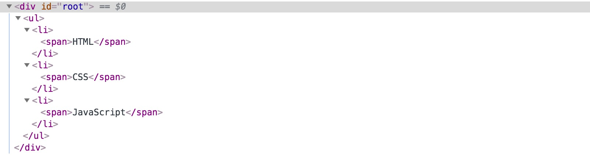

# # 概述

组件可以将UI切分成一些的独立的、可复用的部件，这样你就只需专注于构建每一个单独的部件。

组件从概念上看就像是函数，它可以接收任意的输入值（称之为“props”），并返回一个需要在页面上展示的React元素。

- React 中创建的组件类以大写字母开头，遵循驼峰命名法则。
- 每个组件内都必须实现自己的render方法。
- 组件只能包含一个顶层标签。

# # 定义组件

## 1. 函数定义组件

```js
function SayHello(props) {
    return (
        <div className='container'>
            <h1>Hello, {props.name}</h1>
        </div>
    );
};
```

## 2. 类定义组件

```js
class SayHello extends React.Component {
    render() {
        return (
            <div className='container'>
                <h1>Hello, {this.props.name}</h1>
            </div>
        )
    }
}
```

上面两个组件在React中是相同的。

# # 组件渲染

```react
ReactDOM.render(
    <SayHello name='Henry' />,
    document.getElementById('root')
);
```

我们来回顾一下在这个例子中发生了什么：

1. 我们对 \<SayHello name="Henry" />元素调用了ReactDOM.render()方法。
2. React将 {name: 'Henry'} 作为props传入并调用SayHello组件。
3. Welcome组件将\<h1>Hello, Henry\</h1>元素作为结果返回。
4. React DOM将DOM更新为\<h1>Hello, Henry\</h1>。

# # 组件样式

组件样式：内联样式、对象样式、选择器样式

我们来看有示例：

```react
let styleObj = {
    color: 'red',
    textDecoration: 'underline'
};
class TestBox extends React.Component {
    render() {
        return (
            <div style={{background:'yellow', border: '1px solid #ccc'}}>
                <h3 style={styleObj}>{this.props.title}</h3>
                <p className='pStyle'>{this.props.des}</p>
            </div>
        )
    }
}

ReactDOM.render(
    <TestBox title='成都' des='历史文化名城，一座你来了就不想走的城市。' />,
    document.getElementById('root')
);
```

> 注意：
>
> 1. HTML5 以 `;` 结尾；React 以 `,` 结尾。
> 2. HTML5 中 key、value都不加引号；React 中属于JavaScript 对象，key 的名字不能出现 `-`，需要使用驼峰命名法。如果value为字符串，需要使用引号。
> 3. HTML5 中，value 如果是数字，需要带单位，React中不需要带单位。

# # 组合组件（父子组件/组件嵌套）

功能：定义一个组件 `WebShow` ，输出网站的名字和网址，网址是一个可以点击的链接。

分析：定义一个组件 `WebName` 负责输出网站名字，定义一个组件 `WebLink` 负责输出网站链接，并且可以点击。

```react
// webshow.js
import React, {Component} from 'react';
// 定义WebName组件显示网站名称
class WebName extends Component {
    render() {
        return (
            <span>李鸿耀博客：</span>
        );
    }
}
// 定义WebLink组件显示网站地址
class WebLink extends Component {
    render() {
        return (
            <a href="https://github.com/LiHongyao/">https://github.com/LiHongyao/</a>
        );
    }
}
// 定义WebShow组件
class WebShow extends Component {
    render() {
        return (
            <div className="webshow">
                <WebName />
                <WebLink />
            </div>
        );
    }
}
// 输出WebShow组件
export default WebShow;
```

```react
// index.js
import ReactDOM from 'react-dom';
import React    from 'react';
import WebShow  from './WebShow'

ReactDOM.render (
    <WebShow />,
    document.getElementById('root')
)
```

渲染结果：


# # Props

props 是组件自身的属性，一般用于嵌套的内外层组件中，负责传递信息（通常是由父层组件向子层组件传递）。

> 注意：props 对象中的属性与组件的属性是一一对应的，不要直接去修改props中的属性值。

```react
class Sum extends React.Component {
    render() {
        return (
            <p>{parseInt(this.props.a) + parseInt(this.props.b)}</p>
        );
    }
}

ReactDOM.render(
    <Sum a="10" b="20"/>,
    document.getElementById('root')
);
```

## 1.  …this.props

props 提供的一个语法糖，可以将父组件中的全部属性都复制给子组件。

```react
class Link extends React.Component {
    render() {
        return (
            <a {...this.props}>{this.props.name}</a>
        )
    }
};
ReactDOM.render(
    <Link href="https://baidu.com" name="百度百科" />,
    document.getElementById('root')
);
```

渲染结果：

```html
<a href="https://baidu.com">百度百科</a>
```

## 2. this.props.children

children 是一个例外，不是跟组件的属性对应的。它表示组件的所有子节点。

示例需求：定义一个列表组件，列表项中显示的内容，以及列表项的数量都由外部决定。

```react
class ListComponent extends React.Component {
    render() {
        return (
            <ul>
                {
                    /*
                    列表项数量以及内容不确定，在创建模板时才能确定
                    利用this.props.children从父组件获取需要展示的列表项内容
                    获取到列表项内容后，需要遍历children，逐项进行设置
                    使用React.Children.map() 方法
                    返回值：数组对象，这里数组中的元素是<li>
                     */
                    React.Children.map(this.props.children, (child) => {
                        // child 是遍历得到的父组件中的子节点
                        return <li>{child}</li>
                    })
                }
            </ul>
        )
    }
}
ReactDOM.render(
    <ListComponent>
        <span>HTML</span>
        <span>CSS</span>
        <span>JavaScript</span>
    </ListComponent>,
    document.getElementById('root')
);
```

渲染结果：



## 3. [prop-types](https://www.npmjs.com/package/prop-types)

> 注意： React.PropTypes 自 React v15.5 起已弃用。请使用 prop-types 库代替。

**\> 安装：**

```shell
$ npm i -S prop-types
```

 **\> 引入：**

```js
import propTypes from 'prop-types';
```

**\> 使用：**

```react
class ShowInfos extends React.Component {
    render() {
        return (
            <div>
                <p>{this.props.name}</p>
                <p>{this.props.age}</p>
            </div>
        );
    }
}
ShowInfos.propTypes = {
    name: PropTypes.string,
    age: PropTypes.oneOfType([
        PropTypes.string,
        PropTypes.number
    ])
};

ReactDOM.render(
    <ShowInfos name='Henry' age='28' />,
    document.getElementById('root')
);
```

## 4. 设置组件属性的默认值

你可以通过配置 `defaultProps` 为 props定义默认值：

```react
// 类型检测
TipBox.propTypes = {
    msg: PropTypes.string
}
// 设置默认值
TipBox.defaultProps = {
    msg: '通知：下午17：00，教学部在会议室1开会！'
}

ReactDOM.render(
    <TipBox />,
    document.getElementById('root')
);
```


