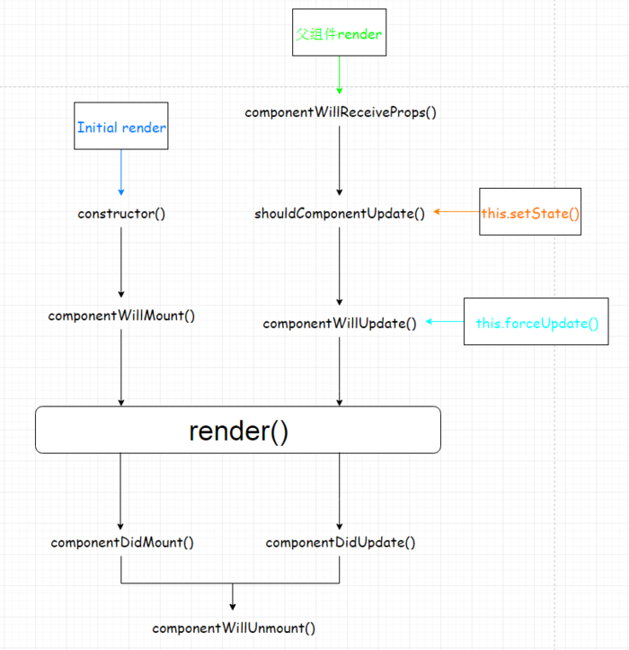

# 一、概述

组件的生命周期可分为三个状态：

- Mounting：组件挂载，已插入真实DOM
- Updating：组件更新，正在被重新渲染
- Unmounting：组件卸载，已移出真实DOM

组件的生命周期可分为四个阶段：创建 、实例化 、更新、销毁。



# 二、生命周期方法

## 1. Mounting 

- componentWillMount()：组件将要挂载
- componentDidMount()：组件已经挂载 *

## 2. Updating

- componentWillReceiveProps(nextProps)：组件接收props
- shouldComponentUpdate(nextProps, nextState)：是否允许组件更新
- componentWillUpdate(nextProps, nextState)：组件将要更新
- componentDidUpdate(prevProps, prevState)：组件已经更新 *

> 触发组件更新方式：render()、setState()、forceUpdate()
>

## 3. Unmounting 

- componentWillUnmount()：组件将要被移除 *

# 三、综合示例

```react

import React from "react"
class LifeCircle extends React.Component {
    // => 构造函数
    constructor(props) {
        super(props);
        console.log("constructor");
    }
    // => 生命周期
    // 组件将要挂载，在render之前执行，但仅执行一次，即使多次重复渲染该组件，或者改变了组件的state
    componentWillMount() {
        console.log("componentWillMount");
    }
    // 组件已经挂载，在render之后执行，同一个组件重复渲染只执行一次
    // 一般做外部数据操作，比如ajax
    componentDidMount() {
        console.log("componentDidMount");
    }
    // 已加载组件，收到新的props之前调用，注意组件初始化渲染时则不会执行
    // nextProps -> object
    componentWillReceiveProps(nextProps) {
        console.log("componentWillReceiveProps");
        console.log(nextProps);
    }
    // 是否允许组件更新
    // nextProps, nextState -> object
    shouldComponentUpdate(nextProps, nextState) {
        console.log('shouldComponentUpdate');
        return true;
    }
    // 接收到新的props或者state后，进行渲染之前调用，此时不允许更新props或state。
    // nextProps, nextState -> object
    componentWillUpdate(nextProps, nextState) {
        console.log('componentWillUpdate');
    }
    // 完成渲染新的props或者state后调用，此时可以访问到新的DOM元素。
    // prevProps, prevState -> object
    componentDidUpdate(prevProps, prevState) {
        console.log('componentDidUpdate');
    }
    // 组件即将卸载：清除定时器、卸载事件等操作
    componentWillUnmount() {
        console.log('componentWillUnmount');
    }
    // => render
    // 必选的方法，创建虚拟DOM，该方法具有特殊的规则：
    // 1. 只能通过this.props和this.state访问数据 
    // 2. 可以返回null、false或任何React组件 
    // 3. 只能出现一个顶级组件（不能返回数组） 
    // 4. 不能改变组件的状态 
    // 5. 不能修改DOM的输出
    render() {
        console.log("render");
        return <div># 生命周期 #</div>
    }
}

export default LifeCircle;
```


