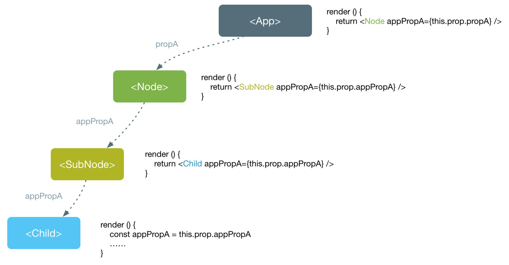
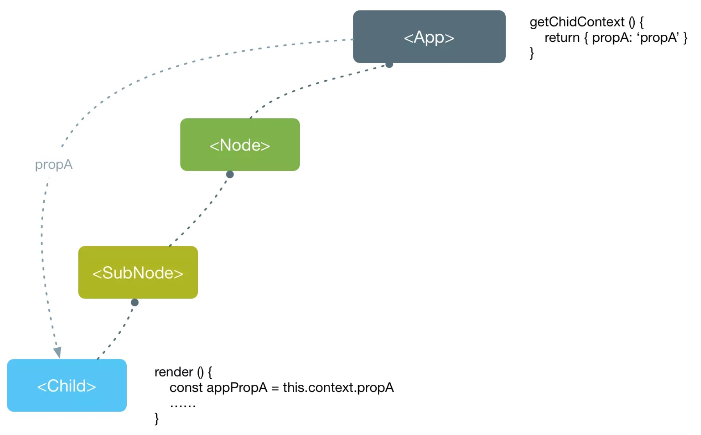

[参考地址 >>](https://react.docschina.org/docs/context.html)

# 一、概述

Context 提供了一个无需为每层组件手动添加 props，就能在组件树间进行数据传递的方法。

当你不想在组件树中通过逐层传递 `props` 或者 `state` 的方式来传递数据时，可以使用 `Context` 来实现**跨层级**的组件数据传递。



使用props或者state传递数据，数据自顶下流，使用 `Context`，可以跨越组件进行数据传递，如下所示：




# 二、API

- [React.createContext](https://react.docschina.org/docs/context.html#reactcreatecontext)：创建上下文
- [Context.Provider](https://react.docschina.org/docs/context.html#contextprovider)：分发
- [Class.contextType](https://react.docschina.org/docs/context.html#classcontexttype)：订阅单个context
- [Context.Consumer](https://react.docschina.org/docs/context.html#contextconsumer)：订阅多个context

# 二、静态传递

静态传递数据只是通过上下文将数据分发至子组件

./src/context.js

```react
import React from 'react';
export const AppContext = React.createContext(null);
```

./src/app.js

```react
import React, { useState } from 'react';
import { AppContext } from './context'
function App() {
  return (
    {/*分发 { name: 'Muzili', gender: 'male'} 数据给所有的子组件*/}
    <AppContext.Provider value={{ name: 'Muzili', gender: 'male'}}>
       <div className="App">...</div>
    </AppContext.Provider> 
  );
}
export default App;
```

./src/components/child.js

```react
import React from 'react';
import { AppContext } from '../../context';
class Child extends React.Component {
  	// 订阅上下文
    static contextType = Context;
    render() {
        const { name, gender } = this.context;
        return (
            <div className="child">
                <p>{name} - {gender}</p>
            </div>

        )
    }
}
export default Child;
```

# 三、动态传递

动态传递即将需要分发的数据绑定在state上，并且分发修改状态的方法给子组件使用。

./src/context.js

```js
import React from 'react';
// 定义上下文模型
export const AppContext = React.createContext({
    count: 0,
    increment: () => {}
});
```

./src/components/child.js

```js
import React from 'react'
import { AppContext } from '../../context'

class Child extends React.Component {
    // 订阅上下文
    static contextType = AppContext;
    render() {
        let { count, increment } = this.context;
        return (
            <button onClick={increment}>Click {count} times!</button>
        )
    }
}

export default Child;
```

./src/app.js

```react
import React from 'react';
import Child from './components/Child/Child'

import { AppContext } from './context';

// 定义一个中间组件 => App > Middle > Child
const Middle = () => {
  return (
    <Child />
  )
}

class App extends React.Component {
  constructor() {
    super();
    // 定义状态
    this.state = {
      count: 0,
      // 绑定修改状态的方法，用于分发
      increment: this.increment.bind(this)
    };
  }
  // => methods
  increment() {
    // 异步
    this.setState(state => ({
      count: state.count + 1 
    }));
  }
  // => render
  render() {
    return (
      <AppContext.Provider value={this.state}>
        <div className="App">
          <Middle />
        </div>
      </AppContext.Provider >
    );
  }
}
export default App;
```


