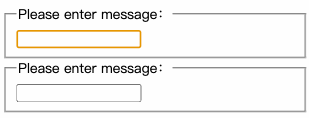

# 一、概述

通常，多个组件需要反映相同的变化数据，这时我们建议将 **共享状态提升到最近的共同父组件中去**。

# 二、示例

功能：有两个输入框，当一个输入框输入内容时，另一个自动输入相同内容

原理：

- 将两个输入框的 `value` 属性的值绑定到父类中去
- 将两个输入框的 `onChange` 事件交由父类进行处理

首先定义输入控件：

```tsx
import React from 'react';

interface IProps {
  msg: string;
  onChange: (v: string) => void;
}
class Input extends React.Component<IProps> {
  // -- events
  onChange = ($event: React.ChangeEvent<HTMLInputElement>) => {
    this.props.onChange($event.target.value);
  };
  // -- render
  render() {
    return (
      <fieldset>
        <legend>Please enter message：</legend>
        <input type='text' value={this.props.msg} onChange={this.onChange} />
      </fieldset>
    );
  }
}

export default Input;
```

上面组件中的 `input` 设置了`value`和`onChange`都是父级组件传递进来的。

接着我们去完善父组件：

```tsx
import React from 'react';
import Input from './Input';

interface IProps {}
interface IState {
  msg: string;
}
class Controller extends React.Component<IProps, IState> {
  // -- constructor
  constructor(props: IProps) {
    super(props);
    this.state = { msg: '' };
  }
  // -- events
  onChange = (v: string) => {
    this.setState({ msg: v });
  };
  // -- render
  render(): React.ReactNode {
    return (
      <>
        <Input msg={this.state.msg} onChange={this.onChange} />
        <Input msg={this.state.msg} onChange={this.onChange} />
      </>
    );
  }
}

export default Controller;
```



这里我们把两个`Input`组件的`value`都绑定到了父组件中，并且将他们的`onChange`事件设置成了同一个事件，这时任何一个组件发生改变都会改变`state`的值，而`state`值的改变也会导致重新渲染页面，即`input`的`value`值。

上面代码的运行顺序是：

- `Input`设置了`value`和`onChange`，只不过这两个值都来自于父组件
- 父组件将两个组件的`value`值保存在`state`中，并设置了子组件要调用的`onChange`事件对应的函数

这里思考一下，我们能不能在子组件`Input`中设置数据处理呢？答案是不行！因为子组件不能操作父组件的`state`值。

# 三、小结

在 React 应用中，任何可变数据应当只有一个相对应的唯一数据源。通常，state 都是首先添加到需要渲染数据的组件中去。然后，如果其他组件也需要这个 state，那么你可以将它提升至这些组件的最近共同父组件中。你应当依靠 [自上而下的数据流](https://zh-hans.reactjs.org/docs/state-and-lifecycle.html#the-data-flows-down)，而不是尝试在不同组件间同步 state。

虽然提升 state 方式比双向绑定方式需要编写更多的样板代码，但带来的好处是，排查和隔离 bug 所需的工作量将会变少。由于存在于组件中的任何 state，仅有组件自己能够修改它，因此 bug 的排查范围被大大缩减了。此外，你也可以使用自定义逻辑来拒绝或转换用户的输入。