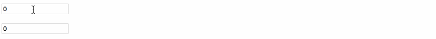

# # 概述

使用 react 经常会遇到几个组件需要共用状态数据的情况。这种情况下，我们最好将这部分共享的状态提升至他们最近的父组件当中进行管理。我们来看一下具体如何操作吧。

# # 示例

功能：有两个输入框，当一个输入框输入内容时，另一个自动输入相同内容

原理：

- 将两个输入框的`value`属性的值绑定到父类中去
- 将两个输入框的`onChange`事件交由父类进行处理

首先定义基本的输入控件：

```react
import React, {Component} from 'react';

class Input extends Component {
    // 监听输入框变化
    handleChange = (event) => {
        // 调用父级中绑定的事件
        this.props.handleChange(event.target.value)
    }
    render() {
        // 获取父级传递过来的输入的值
        const inputNumber = this.props.number;
        return (
            <p><input type='text' value={inputNumber} onChange={this.handleChange} /></p>
        )
    }
}
export default Input;
```

上面组件中的 `input` 设置了`value`和`onChange`都是父级组件传递进来的。

接着我们去完善父组件：

```react
class Caculator extends Component {
    constructor(props) {
        super(props);
        this.state = {number: 0 }
    }
    handleChange = (number) => {
        this.setState({number})
    }
    render() {
        const number = this.state.number;
        return (
            <div>
                <Input number={number} handleChange={this.handleChange} />
                <Input number={number} handleChange={this.handleChange} />
            </div>
        )
    }
}
export default Caculator;
```



这里我们把两个`Input`组件的`value`都绑定到了父组件`Caculator`中，并且将他们的`onChange`事件设置成了同一个事件，这时任何一个组件发生改变都会改变`state`的值，而`state`值的改变也会导致重新渲染页面，即`input`的`value`值。

上面代码的运行顺序是：

- `Input`设置了`value`和`onChange`，只不过这两个值都在自于父组件传递进来的
- 父组件将两个组件的`value`值保存在`state`中，并设置了子组件要调用的`onChange`事件对应的函数

这里思考一下，我们能不能在子组件`Input`中设置数据处理呢？答案是不行！因为子组件不能操作父组件的`state`值。