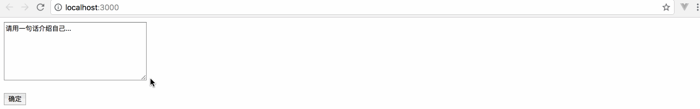
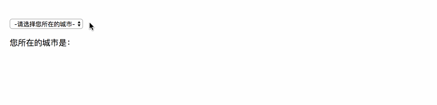
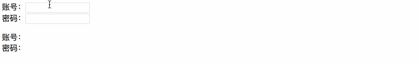

# 一、概述

在 React 里，HTML 表单元素的工作方式和其他的 DOM 元素有些不同，这是因为表单元素通常会保持一些内部的 state。例如这个纯 HTML 表单只接受一个名称：

```react
<form action="...">
  <label>
    名字:
    <input type="text" name="name" />
  </label>
  <input type="submit" value="提交" />
</form>
```

此表单具有默认的 HTML 表单行为，即在用户提交表单后浏览到新页面。如果你在 React 中执行相同的代码，它依然有效。但大多数情况下，使用 JavaScript 函数可以很方便的处理表单的提交， 同时还可以访问用户填写的表单数据。实现这种效果的标准方式是使用“受控组件”。

# 二、受控组件

在HTML当中，像 `<input>`,`<textarea>`, 和 `<select>`这类表单元素会维持自身状态，并根据用户输入进行更新。但在React中，可变的状态通常保存在组件的状态属性中，并且只能用 [`setState()`](https://doc.react-china.org/docs/react-component.html#setstate) 方法进行更新。

我们通过使react变成一种单一数据源的状态来结合二者。React负责渲染表单的组件仍然控制用户后续输入时所发生的变化。相应的，其值由React控制的输入表单元素称为“受控组件”。

## 1. input

我们将以受控组件的形式实现一个实时显示用户输入内容的例子：

```react
import React from "react";
export default class Input extends React.Component {
    // => constructor
    constructor(props) {
        super(props);
        this.state = {
            value: "please enter..."
        }
    }
    // => events
    handleChange(event) {
        event.persist();
        this.setState((preState, props) => ({
            value: event.target.value
        }));
    }
    // => render
    render() {
        return <form>
            <input type="text" value={this.state.value} onChange={this.handleChange.bind(this)}></input>
            <p>{this.state.value}</p>
        </form>
    }
}
```

显示效果：


由于 `val` 属性是在我们的表单元素上设置的，因此显示的值将始终为 React数据源上`this.state.val` 的值。由于每次按键都会触发 `inputChange` 来更新当前React的state，所展示的值也会随着不同用户的输入而更新。

使用”受控组件”,每个状态的改变都有一个与之相关的处理函数。这样就可以直接修改或验证用户输入。例如，我们如果想限制输入全部是大写字母，我们可以将`inputChange` 写为如下：

```react
inputChange(event) {
    // 更新this.state.val
    this.setState({
        val: event.target.value.toUpperCase()
    });
}
```

## 2. textarea

```react
import React, {Component} from 'react';
class TextArea extends Component {
    constructor(props) {
        super(props);
        this.state = {
            val: '请用一句话介绍自己...'
        }
        this.inputChange  = this.inputChange.bind(this);
        this.handleSubmit = this.handleSubmit.bind(this);
    }
    textareaChange(event) {
        this.setState({
            val: event.target.value
        });
    }
    handleSubmit(event) {
        alert(this.state.val);
        event.preventDefault();
    }
    render() {
        let val = this.state.val;
        return (
            <form name='myForm' onSubmit={this.handleSubmit}>
                <textarea  type='text' value={val} onChange={this.textareaChange}/>
                <p><button type='submit'>确定</button></p>
            </form>
        )
    }
}

export default TextArea;
```

```react
import React from 'react';
import ReactDOM from 'react-dom';
import TextArea from './textarea'

ReactDOM.render(
    (<div className='content'>
        <TextArea />
    </div>),
    document.getElementById('root')
)
```

演示效果：



## 3. select

```react
import React, {Component} from 'react';
class Select extends Component {
    constructor(props) {
        super(props);
        this.state = {
            value: ''
        }
        this.handleChange = this.handleChange.bind(this);
    }
    handleChange(event) {
        this.setState({
            value: event.target.value
        });
    }
    render() {
        return (
            <form name='myForm' onSubmit={this.handleSubmit}>
                <select value={this.state.value} onChange={this.handleChange}>
                    <option value=''>-请选择您所在的城市-</option>
                    <option value='北京'>北京</option>
                    <option value='上海'>上海</option>
                    <option value='成都'>成都</option>
                    <option value='广州'>广州</option>
                    <option value='西安'>西安</option>
                    <option value='昆明'>昆明</option>
                </select>
                <p>您所在的城市是：{this.state.value}</p>
            </form>
        )
    }
}

export default Select;
```

```react
import React from 'react';
import ReactDOM from 'react-dom';
import Select from './select'

ReactDOM.render(
    (<div className='content'>
        <Select />
    </div>),
    document.getElementById('root')
)
```

演示效果：



总之，`<input type="text">`, `<textarea>`, 和 `<select>` 都十分类似 - 他们都通过传入一个`value`属性来实现对组件的控制。

## 4. 多个输入的解决方案 

当你有处理多个受控的`input`元素时，你可以通过给每个元素添加一个`name`属性，来让处理函数根据 `event.target.name`的值来选择做什么。

```react
// test.js
import React, {Component} from 'react';
class Reservation extends Component {
    constructor(props) {
      super(props);
      this.state = {};
      this.handleInputChange = this.handleInputChange.bind(this);
    }
  
    handleInputChange(event) {
        let name  = event.target.name; 
        let value = event.target.value;
        this.setState({
            [name]: value
        })
    }
  
    render() {
      return (
        <form>
            <label>账号：</label>
            <input type='text' name='username' onChange={this.handleInputChange} />

            <br />

            <label>密码：</label>
            <input type='password' name='password' onChange={this.handleInputChange} />

            <p>账号：{this.state.username} <br/> 密码：{this.state.password}</p>
        </form>
      );
    }
  }
  export default Reservation;
```

```react
import React from 'react';
import ReactDOM from 'react-dom';
import Reservation from './test'

ReactDOM.render(
    (<div className='content'>
        <Reservation />
    </div>),
    document.getElementById('root')
)
```

演示效果：



# 三、非受控组件

可以 [使用 ref 转发](https://react.docschina.org/docs/forwarding-refs.html) 从 DOM 获取表单值：

```react
import React from "react";
export default class LoginBox extends React.Component {
    // => events 
    handleLogin() {
        let username = this.act.value;
        let password = this.psw.value;
        console.log(username, password);
    }
    // => render
    render() {
        return <form>
            <input type="text"  ref={(input) => this.act = input}></input>
            <input type="password"  ref={(input) => this.psw = input}></input>
            <button type="button" onClick={this.handleLogin.bind(this)}>登录</button>
        </form>
    }
}
```

由于非受控组件将真实数据保存在 DOM 中，因此在使用非受控组件时，更容易同时集成 React 和非 React 代码。如果你想快速而随性，这样做可以减小代码量。否则，你应该使用受控组件。

## 1. 默认值

在 React 的生命周期中，表单元素上的 `value` 属性将会覆盖 DOM 中的值。使用非受控组件时，通常你希望 React 可以为其指定初始值，但不再控制后续更新。要解决这个问题，你可以指定一个 `defaultValue` 属性而不是 `value`。

```react
render() {
    return (
        <form onSubmit={this.handleSubmit}>
            {/* ref */}
            <input 
                type='text' 
                ref={(input) => this.input = input} 
                defaultValue='Today is very nice.'/>
            <button type='submit' >SUBMIT</button>
        </form>
    )
}
```

同样，`<input type="checkbox">` 和 `<input type="radio">` 支持 `defaultChecked`，`<select>` 和 `<textarea>` 支持 `defaultValue`.


