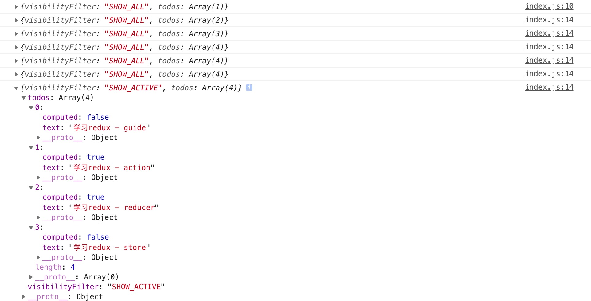

http://cn.redux.js.org/

https://cn.mobx.js.org/

# # 简介

Redux 是 JavaScript 状态容器，提供可预测化的状态管理。可以让你构建一致化的应用，运行于不同的环境（客户端、服务器、原生应用），并且易于测试。不仅于此，它还提供超爽的开发体验。Redux 除了和 [React](https://facebook.github.io/react/) 一起用外，还支持其它界面库。 它体小精悍（只有 2kB，包括依赖）。

## 1. 动机

随着 JavaScript 单页应用开发日趋复杂，**JavaScript 需要管理比任何时候都要多的 state （状态）**。 这些 state 可能包括服务器响应、缓存数据、本地生成尚未持久化到服务器的数据，也包括 UI 状态，如激活的路由，被选中的标签，是否显示加载动效或者分页器等等。

管理不断变化的 state 非常困难。如果一个 model 的变化会引起另一个 model 变化，那么当 view 变化时，就可能引起对应 model 以及另一个 model 的变化，依次地，可能会引起另一个 view 的变化。直至你搞不清楚到底发生了什么。**state 在什么时候，由于什么原因，如何变化已然不受控制。** 当系统变得错综复杂的时候，想重现问题或者添加新功能就会变得举步维艰。

如果这还不够糟糕，考虑一些**来自前端开发领域的新需求**，如更新调优、服务端渲染、路由跳转前请求数据等等。前端开发者正在经受前所未有的复杂性，[难道就这么放弃了吗？](http://www.quirksmode.org/blog/archives/2015/07/stop_pushing_th.html) ，当然不是。

这里的复杂性很大程度上来自于：**我们总是将两个难以理清的概念混淆在一起：变化和异步**。 我称它们为[曼妥思和可乐](https://en.wikipedia.org/wiki/Diet_Coke_and_Mentos_eruption)。如果把二者分开，能做的很好，但混到一起，就变得一团糟。一些库如 [React](http://facebook.github.io/react) 试图在视图层禁止异步和直接操作 DOM 来解决这个问题。美中不足的是，React 依旧把处理 state 中数据的问题留给了你。Redux 就是为了帮你解决这个问题。

跟随 [Flux](http://facebook.github.io/flux)、[CQRS](http://martinfowler.com/bliki/CQRS.html) 和 [Event Sourcing](http://martinfowler.com/eaaDev/EventSourcing.html) 的脚步，通过限制更新发生的时间和方式，**Redux 试图让 state 的变化变得可预测**。这些限制条件反映在 Redux 的[三大原则](http://cn.redux.js.org/docs/introduction/ThreePrinciples.html)中。

## 2. 核心概念

Redux 本身很简单。

当使用普通对象来描述应用的 state 时。例如，todo 应用的 state 可能长这样：

```javascript
{
  todos: [{
    text: '学习 vue-router',
    completed: true
  }, {
    text: '学习 redux',
    completed: false
  }],
  visibilityFilter: 'SHOW_COMPLETED'
}
```

这个对象就像 “Model”，区别是它并没有 setter（修改器方法）。因此其它的代码不能随意修改它，造成难以复现的 bug。

要想更新 state 中的数据，你需要发起一个 action。Action 就是一个普通 JavaScript 对象（注意到没，这儿没有任何魔法？）用来描述发生了什么。下面是一些 action 的示例：

```javascript
{ type: 'ADD_TODO', text: '学习 NodeJS' }
{ type: 'TOGGLE_TODO', index: 1 }
{ type: 'SET_VISIBILITY_FILTER', filter: 'SHOW_ALL' }
```

强制使用 action 来描述所有变化带来的好处是可以清晰地知道应用中到底发生了什么。如果一些东西改变了，就可以知道为什么变。action 就像是描述发生了什么的指示器。最终，为了把 action 和 state 串起来，开发一些函数，这就是 reducer。再次地，**reducer 只是一个接收 state 和 action，并返回新的 state 的函数**。 对于大的应用来说，不大可能仅仅只写一个这样的函数，所以我们编写很多小函数来分别管理 state 的一部分：

```javascript
function visibilityFilter(state = 'SHOW_ALL', action) {
  if (action.type === 'SET_VISIBILITY_FILTER') {
    return action.filter
  } else {
    return state
  }
}

function todos(state = [], action) {
  switch (action.type) {
    case 'ADD_TODO':
      return state.concat([{ text: action.text, completed: false }])
    case 'TOGGLE_TODO':
      return state.map((todo, index) =>
        action.index === index
          ? { text: todo.text, completed: !todo.completed }
          : todo
      )
    default:
      return state
  }
}
```

再开发一个 reducer 调用这两个 reducer，进而来管理整个应用的 state：

```js
function todoApp(state = {}, action) {
  return {
    todos: todos(state.todos, action),
    visibilityFilter: visibilityFilter(state.visibilityFilter, action)
  }
}
```

这差不多就是 Redux 思想的全部。注意到没我们还没有使用任何 Redux 的 API。Redux 里有一些工具来简化这种模式，但是主要的想法是如何根据这些 action 对象来更新 state，而且 90% 的代码都是纯 JavaScript，没用 Redux、Redux API 和其它魔法。

## 3. 三大原则

### 3.1. 单一数据源

整个应用的 state 被储存在一棵 object tree 中，并且这个 object tree 只存在于唯一一个 store 中。

### 3.2. State 是只读的 

唯一改变 state 的方法就是触发 action，action 是一个用于描述已发生事件的普通对象。

### 3.3. 使用纯函数(reducer)来执行修改

为了描述 action 如何改变 state tree ，你需要编写 reducers。

Reducer 只是一些纯函数，它接收先前的 state 和 action，并返回新的 state。刚开始你可以只有一个 reducer，随着应用变大，你可以把它拆成多个小的 reducers，分别独立地操作 state tree 的不同部分，因为 reducer 只是函数，你可以控制它们被调用的顺序，传入附加数据，甚至编写可复用的 reducer 来处理一些通用任务，如分页器。

```js
function visibilityFilter(state = 'SHOW_ALL', action) {
  switch (action.type) {
    case 'SET_VISIBILITY_FILTER':
      return action.filter
    default:
      return state
  }
}

function todos(state = [], action) {
  switch (action.type) {
    case 'ADD_TODO':
      return [
        ...state,
        {
          text: action.text,
          completed: false
        }
      ]
    case 'COMPLETE_TODO':
      return state.map((todo, index) => {
        if (index === action.index) {
          return Object.assign({}, todo, {
            completed: true
          })
        }
        return todo
      })
    default:
      return state
  }
}

import { combineReducers, createStore } from 'redux'
let reducer = combineReducers({ visibilityFilter, todos })
let store = createStore(reducer)
```

# # 准备

**\> 在什么场景使用Redux? **

Redux 是负责组织 state 的工具，但你也要考虑它是否适合你的情况。不要因为有人告诉你要用 Redux 就去用，花点时间好好想想使用了 Redux 会带来的好处或坏处。

在下面的场景中，引入 Redux 是比较明智的：

- 你有着相当大量的、随时间变化的数据
- 你的 state 需要有一个单一可靠数据来源
- 你觉得把所有 state 放在最顶层组件中已经无法满足需要了

从组件角度看，如果你的应用有以下场景，可以考虑使用 Redux。

- 某个组件的状态，需要共享
- 某个状态需要在任何地方都可以拿到
- 一个组件需要改变全局状态
- 一个组件需要改变另一个组件的状态                                                                                                                                                                              

# # 安装

```shell
$ npm i -S redux  
or
$ yarn add -s redux
```

# # 基础

以 to_dolist（待办事项清单）项目为例：

## 1. Action

**Action** 是把数据从视图传到 store 的有效载荷。它是 store 数据的 **唯一** 来源。一般来说你会通过 `store.dispatch()` 将 action 传到 store。也就是说，通过action修改数据，类似于Vuex中的mutaions。

添加新的 todo 任务（待办事项）的 action 是这样的：

./src/store/actions/index.js

```js
const ADD_TODO = 'ADD_TODO'
```

```js
{
  type: ADD_TODO,
  text: "写工作日志"
}
```

Action 本质上是 JavaScript 普通对象。我们约定，action 内必须使用一个字符串类型的 `type` 字段来表示将要执行的动作。多数情况下，`type` 会被定义成字符串常量。当应用规模越来越大时，建议使用单独的模块或文件来存放 action。

```js
import {
    ADD_TODO
} from "../actionTypes";
```

> 样板文件使用提醒
>
> 使用单独的模块或文件来定义 action type 常量并不是必须的，甚至根本不需要定义。对于小应用来说，使用字符串做 action type 更方便些。不过，在大型应用中把它们显式地定义成常量还是利大于弊的。参照 [减少样板代码](http://cn.redux.js.org/docs/recipes/ReducingBoilerplate.html) 获取更多保持代码简洁的实践经验。

除了 `type` 字段外，action 对象的结构完全由你自己决定。

> 提示：**我们应该尽量减少在 action 中传递的数据**。比如上面的例子，传递 `id` 就比把整个任务对象传过去要好。

### 1.1 创建函数

**Action 创建函数** 就是生成 action 的方法。“action” 和 “action 创建函数” 这两个概念很容易混在一起，使用时最好注意区分。在 Redux 中的 action 创建函数只是简单的返回一个 action:

./src/store/actions/index.js

```js
import {
    ADD_TODO
} from "../actionTypes";

// 添加待办事项
export  const addToDo = (text) => ({
    type: ADD_TODO,
    text
})
```

这样做将使 action 创建函数更容易被移植和测试。

当调用 action 创建函数时，一般会把 action 创建函数的结果传给 `dispatch()` 方法即可发起一次 dispatch 过程。类似于Vuex中的commit提交一次Mutaions.

```js
store.dishpatch(addToDo(text));
```

## 2. Reducer

Reducers 指定了应用状态的变化如何响应 [actions](http://cn.redux.js.org/docs/basics/Actions.html) 并发送到 store 的，记住 actions 只是描述了有事情发生了这一事实，并没有描述应用如何更新 state。

### 2.1. 设计state结构

在 Redux 应用中，所有的 state 都被保存在一个单一对象中。建议在写代码前先想一下这个对象的结构。如何才能以最简的形式把应用的 state 用对象描述出来？

以 todo（待办事项） 应用为例，需要保存两种不同的数据：

- 当前选中的待办事项过滤条件；
- 完整的待办事项（包括已完成和未完成的）列表；


```js
const initialState = {
    visibilityFilter: "SHOW_ALL",
    todos: [
        {text: "学习 redux", computed: false}
    ]
}
```

> 注意：开发复杂的应用时，不可避免会有一些数据相互引用。建议你尽可能地把 state [范式化](https://www.redux.org.cn/docs/recipes/reducers/NormalizingStateShape.html)，不存在嵌套。把所有数据放到一个对象里，每个数据以 ID 为主键，不同实体或列表间通过 ID 相互引用数据。把应用的 state 想像成数据库。例如，实际开发中，在 state 里同时存放 todosById: { id -> todo } 和 todos: array\<id> 是比较好的方式，本文中为了保持示例简单没有这样处理。

### 2.2. reducer 函数

现在我们已经确定了 state 对象的结构，就可以开始开发 reducer。reducer 就是一个纯函数，接收旧的 state 和 action，返回新的 state。通过reducer函数可以处理之前创建的action。

保持 reducer 纯净非常重要。**永远不要**在 reducer 里做这些操作

- 修改传入参数；
- 执行有副作用的操作，如 API 请求和路由跳转；
- 调用非纯函数，如 `Date.now()` 或 `Math.random()`。

> 提示：现在只需要谨记 reducer 一定要保持纯净。**只要传入参数相同，返回计算得到的下一个 state 就一定相同。没有特殊情况、没有副作用，没有 API 请求、没有变量修改，单纯执行计算**

明白了这些之后，就可以开始编写 reducer，并让它来处理之前定义过的 [action](http://cn.redux.js.org/docs/basics/Actions.html)。这里以处理 “ADD_TODO”  这个action为例。

.src/store/reducers/index.js

```js
import {
    ADD_TODO
} from "../actionTypes";


const initialState = {
    // 待办事项显示的过滤条件
    visibilityFilter: 'SHOW_ALL',
    // 待办事项集合
    todos: [
      {
        text: '学习 react-router',
        completed: true,
      },
      {
        text: '学习 redux',
        completed: false
      }
    ]
  }
export const todoApp = (state = initialState, action) => {
    switch (action.type) {
        case ADD_TODO:
            return Object.assign({}, state, {
                todos: [
                    // 先取出之前的todos
                    ...state.todos,
                    // 再添加新的todo
                    {
                        // 待办事项内容
                        text: action.text,
                        // 待办事项状态
                        computed: false
                    }

                ]
            })
            break;
        default:
            return state;
    }
}
```

> 注意：
>
> 1. 不要修改 state。 使用 Object.assign() 新建了一个副本。不能这样使用 Object.assign(state, {...})，因为它会改变第一个参数的值。你必须把第一个参数设置为空对象。
> 2. 在 default 情况下返回旧的 state。遇到未知的 action 时，一定要返回旧的 state。

### 2.3. 处理多个reducer

如果要处理多个reducer，可直接在Switch语句中添加case字段来进行匹配，比如我们这里还有两个action：

```js
// 切换待办事项状态
export const toggleTodo = (index) =>({
    type: "TOGGLE_TODO",
    index
});

// 设置待办事项显示的过滤条件
// "SHOW_ALL": 显示所有
// "SHOW_COMPLETED": 显示已完成
// "SHOW_ACTIVE": 显示未完成
export const setVisibilityFilter = (filter) => ({
    type: "SET_VISIBILITY_FILTER",
    filter
});
```

现在对这两个action进行处理，代码如下：

```js
import {
    ADD_TODO
} from "../actionTypes";

const initialState = {
    // 待办事项显示的过滤条件
    visibilityFilter: 'SHOW_ALL',
    // 待办事项集合
    todos: [
        {
            text: '学习 react-router',
            completed: true,
        },
        {
            text: '学习 redux',
            completed: false
        }
    ]
}

export const todoApp = (state = initialState, action) => {
    switch (action.type) {
        case ADD_TODO:
            return Object.assign({}, state, {
                todos: [
                    // 先取出之前的todos
                    ...state.todos,
                    // 再添加新的todo
                    {
                        // 待办事项内容
                        text: action.text,
                        // 待办事项状态
                        completed: false
                    }
                ]
            }) 
            break;
        case "TOGGLE_TODO":
            return Object.assign({}, state, {
                todos: state.todos.map((todo, index) => {
                   if(action.index == index) {
                       return Object.assign({}, todo, {
                           completed: !todo.completed
                       })
                   }
                })
            })
            break;
        case "SET_VISIBILITY_FILTER": 
            return Object.assign({}, state, {
                filter: action.filter
            })
            break;
        default:
            return state;
    }
};

```

### 2.4. 拆分reducer

目前的reducer函数代码看起来有些冗长，在这个示例中，待办事项列表（todos）和显示的过滤条件（visibilityFilter）的更新看起来是相互独立的，我们可以把todos的逻辑拆分到一个独立的函数中。这里将每个reducer函数模块化，创建文件：

```js
- src
  - store 
    - reducers
      - idnex.js  // 主reducer，合并子reducer
      - todos.js  // 子reducer
      - setVisibilityFilter.js // 子reducer
```

./src/store/resucers/todo.js

```js
export const todos = (state = [], action) => {
    switch (action.type) {
        case "ADD_TODO":
            return [
                ...state,
                {
                    text: action.text,
                    completed: false
                }
            ]
            break;
        case "TOGGLE_TODO":
            return state.map((todo, index) => {
                if (action.index == index) {
                    return Object.assign({}, todo, {
                        completed: !todo.completed
                    })
                }
                return todo;
            })
            break;
        default:
            return state;
    }
}
```

> 注意：todos 依旧接收 state，但它变成了一个数组！现在 todoApp 只把需要更新的一部分 state 传给 todos 函数，todos 函数自己确定如何更新这部分数据。这就是所谓的 reducer 合成，它是开发 Redux 应用最基础的模式。

./src/store/reducers/setVisibilityFilter.js

```js
export const visibilityFilter = (state = "", action) => {
    switch (action.type) {
        case "SET_VISIBILITY_FILTER":
            return action.filter
            break;
        default:
            return state;
    }
}
```

./src/store/reducers/index.js

```js
// 引入combineReducers，合并reducer
import {combineReducers} from "redux";
// 引入两个子reducer
import {todos} from "./todos";
import {visibilityFilter} from "./visibilityFilter";

// 合并reducers
export const todoApp = combineReducers({
    todos,
  	// reducer可以自定义
    filter:visibilityFilter
});
```

> 注意：reducer的key值其实就是state里面的key值

## 3. Store

在前面的章节中，我们学会了使用 [action](http://cn.redux.js.org/docs/basics/Actions.html) 来描述“发生了什么”，和使用 [reducers](http://cn.redux.js.org/docs/basics/Reducers.html) 来根据 action 更新 state 的用法。

Store 就是把它们联系到一起的对象。Store 有以下职责：

- 维持应用的 state；
- 提供 [`getState()`](http://cn.redux.js.org/docs/api/Store.html#getState) 方法获取 state；
- 提供 [`dispatch(action)`](http://cn.redux.js.org/docs/api/Store.html#dispatch) 方法更新 state；
- 通过 [`subscribe(listener)`](http://cn.redux.js.org/docs/api/Store.html#subscribe) 注册监听器;
- 通过 [`subscribe(listener)`](http://cn.redux.js.org/docs/api/Store.html#subscribe) 返回的函数注销监听器。

再次强调一下 **Redux 应用只有一个单一的 store**。当需要拆分数据处理逻辑时，你应该使用 [reducer 组合](http://cn.redux.js.org/docs/basics/Reducers.html#splitting-reducers) 而不是创建多个 store。

根据已有的 reducer 来创建 store 是非常容易的。在前一个章节中，我们使用 [`combineReducers()`](http://cn.redux.js.org/docs/api/combineReducers.html) 将多个 reducer 合并成为一个。现在我们将其导入，并传递 [`createStore()`](http://cn.redux.js.org/docs/api/createStore.html)。

```js
import {createStore} from "redux";
import {todoApp} from "./reducers";

// 设置初始数据
const initialState = {
    filter: "SHOW_ALL",
    todos: [
        {text: "学习redux - guide", computed: false}
    ]
}
export const store = createStore(todoApp, initialState);
```

[`createStore()`](http://cn.redux.js.org/docs/api/createStore.html) 的第二个参数是可选的, 用于设置 state 初始状态。

### 3.1. 发起action

现在我们已经创建好了 store ，让我们来验证一下！虽然还没有界面，我们已经可以测试数据处理逻辑了。

./src/index.js

```js
import {
    addTodo,
    toggleTodo,
    setVisibilityFilter
} from "./store/actions";
import {store} from "./store";


// 打印初始状态
console.log(store.getState());

// 每次 state 更新时，打印日志
// 注意 subscribe() 返回一个函数用来注销监听器
const unsubscribe = store.subscribe(() => console.log(store.getState()))

// 发起一系列 action
store.dispatch(addTodo("学习redux - action"));
store.dispatch(addTodo("学习redux - reducer"));
store.dispatch(addTodo("学习redux - store"));
store.dispatch(toggleTodo(1));
store.dispatch(toggleTodo(2));
store.dispatch(setVisibilityFilter("SHOW_ACTIVE"));


// 停止监听 state 更新
unsubscribe();
```

输出结果：



## 4. 数据流（工作原理）

**严格的单向数据流**是 Redux 架构的设计核心。

Redux 应用中数据的生命周期遵循下面 4 个步骤：

**a. 调用 store.dispatch(action)，相当于Vuex中 commit一次mutaions**

**b. Redux store 调用传入的 reducer 函数**

Store 会把两个参数传入 reducer： 当前的 state 树和 action。例如，在这个 todo 应用中，根 reducer 可能接收这样的数据：

```js
// 当前应用的 state（todos 列表和选中的过滤器）
let previousState = {
  visibilityFilter: 'SHOW_ALL',
  todos: [
    {
      text: '学习redux - guide',
      complete: false
    }
  ]
}

// 将要执行的 action（添加一个 todo）
let action = {
  type: 'ADD_TODO',
  text: '学习redux - 数据流'
}

// reducer 返回处理后的应用状态
let nextState = todoApp(previousState, action)
```

> 注意： reducer 是纯函数。它仅仅用于计算下一个 state。它应该是完全可预测的：多次传入相同的输入必须产生相同的输出。它不应做有副作用的操作，如 API 调用或路由跳转。这些应该在 dispatch action 前发生。

**c. 根 reducer 应该把多个子 reducer 输出合并成一个单一的 state 树**

**d. Redux store 保存了根 reducer 返回的完整 state 树**

这个新的树就是应用的下一个 state！所有订阅 store.subscribe(listener) 的监听器都将被调用；监听器里可以调用 store.getState() 获得当前 state。

现在，可以应用新的 state 来更新 UI。如果你使用了 React Redux 这类的绑定库，这时就应该调用 component.setState(newState) 来更新。

## 5. 搭配 React

为了方便使用，Redux 的作者封装了一个 React 专用的库 [React-Redux](https://github.com/reactjs/react-redux)，本文主要介绍它。

这个库是可以选用的。实际项目中，你应该权衡一下，是直接使用 Redux，还是使用 React-Redux。后者虽然提供了便利，但是需要掌握额外的 API，并且要遵守它的组件拆分规范。

### 5.1. 安装 react-redux

```shell
$ npm i -S react-redux
or
$ yarn add -s react-redux
```

### 5.2. 容器组件和展示组件

React-Redux 将所有组件分成两大类

- 容器组件：Smart/Container Components
- 展示组件：Dumb/Presentational Components

**\> 展示组件**

展示组件有以下几个特征：

- 只负责 UI 的呈现，不带有任何业务逻辑
- 没有状态（ 即不使用 *this.state*  这个变量 ）
- 所有数据都由参数（ *this.props*）提供
- 不使用任何 Redux 的 API

下面是一个展示组件的示例：

```react
const Button = text => (<button type="button">{text}</button>)
```

因为不含有状态，展示组件又称为"纯组件"，即它纯函数一样，纯粹由参数决定它的值。

**\> 容器组件**

容器组件的特征恰恰相反。

- 负责管理数据和业务逻辑，不负责 UI 的呈现
- 带有内部状态
- 使用 Redux 的 API

总之，只要记住一句话就可以了：展示组件负责 UI 的呈现，容器组件负责管理数据和逻辑。

你可能会问，如果一个组件既有 UI 又有业务逻辑，那怎么办？回答是，将它拆分成下面的结构：外面是一个容器组件，里面包了一个展示组件。前者负责与外部的通信，将数据传给后者，由后者渲染出视图。

React-Redux 规定，所有的展示组件都由用户提供，容器组件则是由 React-Redux 自动生成。也就是说，用户负责视觉层，状态管理则是全部交给它。

|                | 展示组件           | 容器组件               |
| -------------- | -------------- | ------------------ |
| **作用**         | 描述如何展现（骨架、样式）  | 描述如何运行（数据获取、状态更新）  |
| **直接使用 Redux** | 否              | 是                  |
| **数据来源**       | props          | 监听 Redux state     |
| **数据修改**       | 从 props 调用回调函数 | 向 Redux 派发 actions |
| **调用方式**       | 手动             | 通常由 React Redux 生成 |

### 5.3. connect()

React-Redux 提供`connect`方法，用于从展示组件生成容器组件。`connect`的意思，就是将这两种组件连起来。

```js
import { connect } from 'react-redux'
const VisibleTodoList = connect()(TodoList);
```

上面代码中，`TodoList`是展示组件，`VisibleTodoList`就是由 React-Redux 通过`connect`方法自动生成的容器组件。

但是，因为没有定义业务逻辑，上面这个容器组件毫无意义，只是 UI 组件的一个单纯的包装层。为了定义业务逻辑，需要给出下面两方面的信息。

1）输入逻辑：外部的数据（即 `state` 对象）如何转换为 展示 组件的参数

2）输出逻辑：用户发出的动作如何变为 Action 对象，从 展示 组件传出去。

因此，`connect`方法的完整 API 如下。

```js
import { connect } from 'react-redux'

const VisibleTodoList = connect(
  mapStateToProps,
  mapDispatchToProps
)(TodoList)
```

上面代码中，`connect` 方法接受两个参数：`mapStateToProps` 和 `mapDispatchToProps`。它们定义了 展示 组件的业务逻辑。前者负责输入逻辑，即将`state`映射到 展示 组件的参数（`props`），后者负责输出逻辑，即将用户对 展示 组件的操作映射成 Action。

### 5.4. mapStateToProps()

`mapStateToProps` 是一个函数。它的作用就是像它的名字那样，建立一个从（外部的）`state`对象到（展示 组件的）`props`对象的映射关系。

作为函数，`mapStateToProps` 执行后应该返回一个对象，里面的每一个键值对就是一个映射。请看下面的例子。

```js
const mapStateToProps = (state) => {
  return {
    todos: getVisibleTodos(state.todos, state.visibilityFilter)
  }
}
```

上面代码中，`mapStateToProps` 是一个函数，它接受 `state` 作为参数，返回一个对象。这个对象有一个 `todos` 属性，代表 展示 组件的同名参数，后面的`getVisibleTodos`也是一个函数，可以从`state`算出 `todos` 的值。

下面就是`getVisibleTodos`的一个例子，用来算出`todos`。

```js
const getVisibleTodos = (todos, filter) => {
  switch (filter) {
    case 'SHOW_ALL':
      return todos
    case 'SHOW_COMPLETED':
      return todos.filter(t => t.completed)
    case 'SHOW_ACTIVE':
      return todos.filter(t => !t.completed)
    default:
      throw new Error('Unknown filter: ' + filter)
  }
}
```

`mapStateToProps`会订阅 Store，每当`state`更新的时候，就会自动执行，重新计算 UI 组件的参数，从而触发 UI 组件的重新渲染。

`mapStateToProps`的第一个参数总是`state`对象，还可以使用第二个参数，代表容器组件的`props`对象。

```js
// 容器组件的代码
//    <FilterLink filter="SHOW_ALL">
//      All
//    </FilterLink>

const mapStateToProps = (state, ownProps) => {
  return {
    active: ownProps.filter === state.visibilityFilter
  }
}
```

使用`ownProps`作为参数后，如果容器组件的参数发生变化，也会引发 UI 组件重新渲染。

`connect`方法可以省略`mapStateToProps`参数，那样的话，UI 组件就不会订阅Store，就是说 Store 的更新不会引起 UI 组件的更新。

### 5.5. mapDispatchToProps()

`mapDispatchToProps`是`connect`函数的第二个参数，用来建立 展示 组件的参数到`store.dispatch`方法的映射。也就是说，它定义了哪些用户的操作应该当作 Action，传给 Store。它可以是一个函数，也可以是一个对象。

如果`mapDispatchToProps`是一个函数，会得到`dispatch`和`ownProps`（容器组件的`props`对象）两个参数。

```js
const mapDispatchToProps = (dispatch, ownProps ) => {
  return {
    onClick: () => {
      dispatch({
        type: 'SET_VISIBILITY_FILTER',
        filter: ownProps.filter
      });
    }
  };
}
```

从上面代码可以看到，`mapDispatchToProps`作为函数，应该返回一个对象，该对象的每个键值对都是一个映射，定义了 展示 组件的参数怎样发出 Action。

如果`mapDispatchToProps`是一个对象，它的每个键名也是对应 展示组件的同名参数，键值应该是一个函数，会被当作 Action creator ，返回的 Action 会由 Redux 自动发出。举例来说，上面的`mapDispatchToProps`写成对象就是下面这样。

```js
const mapDispatchToProps = {
  onClick: (filter) => {
    type: 'SET_VISIBILITY_FILTER',
    filter: filter
  };
}
```

### 5.6. \< Provider > 组件

`connect` 方法生成容器组件以后，需要让容器组件拿到 `state` 对象，才能生成 展示 组件的参数。

一种解决方法是将`state`对象作为参数，传入容器组件。但是，这样做比较麻烦，尤其是容器组件可能在很深的层级，一级级将`state`传下去就很麻烦。

React-Redux 提供`Provider`组件，可以让容器组件拿到`state`。

```react
import { Provider } from 'react-redux'
import { createStore } from 'redux'
import todoApp from './reducers'
import App from './components/App'

let store = createStore(todoApp);

render(
  <Provider store={store}>
    <App />
  </Provider>,
  document.getElementById('root')
)
```

上面代码中，`Provider`在根组件外面包了一层，这样一来，`App`的所有子组件就默认都可以拿到`state`了。

它的原理是`React`组件的[`context`](https://facebook.github.io/react/docs/context.html)属性，请看源码。

```react
class Provider extends Component {
  getChildContext() {
    return {
      store: this.props.store
    };
  }
  render() {
    return this.props.children;
  }
}

Provider.childContextTypes = {
  store: React.PropTypes.object
}
```

上面代码中，`store`放在了上下文对象`context`上面。然后，子组件就可以从`context`拿到`store`，代码大致如下。

```react
class VisibleTodoList extends Component {
  componentDidMount() {
    const { store } = this.context;
    this.unsubscribe = store.subscribe(() =>
      this.forceUpdate()
    );
  }

  render() {
    const props = this.props;
    const { store } = this.context;
    const state = store.getState();
    // ...
  }
}

VisibleTodoList.contextTypes = {
  store: React.PropTypes.object
}
```

`React-Redux`自动生成的容器组件的代码，就类似上面这样，从而拿到`store`。

### 5.7. 实例：计数器

我们来看一个实例。下面是一个计数器组件，它是一个纯的展示组件。

```react
// ./src/components/counter.js
import React, {Component} from "react";

class Counter extends Component {
    render() {
        // 获取props
        const {value, onIncreaseClick} = this.props;
        return (
            <div style={{textAlign:"center"}}>
                <span>{value}</span>
                <button 
                    style={{display:"block", margin:"0 auto"}}
                    type="button"
                    onClick={onIncreaseClick}>
                    Increase
                </button>
            </div>
        )
    }
}

export default Counter;
```

上面代码中，这个 展示 组件有两个参数：`value` 和 `onIncreaseClick`。前者需要从`state`计算得到，后者需要向外发出 Action。

接下来，我们定义一个action

```js
// ./src/store/actions/index.js
export const increaseAction = {
  type: "INCREASE"
}
```

接着，定义`value`到`state`的映射，以及`onIncreaseClick`到`dispatch`的映射。也就是所谓的容器组件

```react
// ./src/containers/App.js
import { connect } from "react-redux";
import { increaseAction } from "../store/actions";
import Counter from "../components/counter";

const mapStateToProps = state  => ({
    value: state.count
});

const mapDishpatchToProps = dispatch => ({
    onIncreaseClick: () => dispatch(increaseAction)
});

// 使用connect方法生成容器组件
export default connect(
    mapStateToProps,
    mapDishpatchToProps
)(Counter);
```

然后，定义这个组件的reducer

```js
// ./src/store/reducer/index.js
const todoApp = (state = {count: 0}, action) => {
    const count = state.count;
    switch(action.type) {
        case "INCREASE": 
            return {count: count + 1}
        default:
            return state
    }
};

export default todoApp;
```

生成 `store` 对象。

```js
import { createStore } from 'redux'
import todoApp from './reducers'

export const store = createStore(todoApp)
```

最后，使用`Provider`在根组件外面包一层

```react
import React from 'react'
import ReactDOM from 'react-dom'
import { Provider } from 'react-redux'
import { store } from "./store"
import App from './containers/App'


ReactDOM.render(
  <Provider store={store}>
    <App />
  </Provider>,
  document.getElementById('root')
)
```

# # react-router 路由库

使用`React-Router`的项目，与其他项目没有不同之处，也是使用`Provider`在`Router`外面包一层，毕竟`Provider`的唯一功能就是传入`store`对象。

```react

const Root = ({ store }) => (
  <Provider store={store}>
    <Router>
      <Route path="/" component={App} />
    </Router>
  </Provider>
);
```


