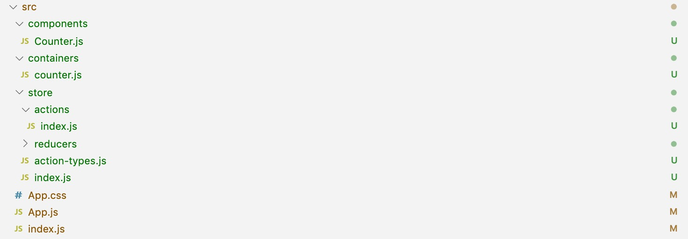

redux：http://cn.redux.js.org/

mobx：https://cn.mobx.js.org/

# 一、简介

Redux 是 JavaScript 状态容器，提供可预测化的状态管理。

> 提示：Redux 的集成是非必选的。

**\# 单向数据流**

我们知道在react中数据是单向流动的。所谓的数据单向流动，顾名思义，就是数据是从一个方向传播下去的意思。

我们假设数据中心是一个负责发行身份证的地方政府，每个人都可以到这里来领取自己的身份证，但是如果你对自己的身份证头像不满意，你不能自己去村口拍个十块钱的大头贴贴上去，也不能自己修改上面的个人信息，这样的身份证是不被承认的（弄不好可能还得坐牢），正确的操作方式应该是，带着你的修改意见，去到地方政府，找相关工作人员帮你重新办理，办理完之后再发放给你。

这个例子当中，数据中心我们视为父组件，身份证就是子组件通过父组件接收到的props，你不能直接修改自己的身份证，也就是你不能直接 this.props.name = '帅哥'，只能通知父组件去修改这个props，即调用父组件提供的changeName方法来操作：this.props.changeName('帅哥')，这个过程事实上是修改了父组件的state，从而使得子元素接收到的数据也发生了改变。

所以数据由始至终都是从父元素流向子元素，我们称为数据单向流动。

我们回想一下我们之前构建过的所有react应用，数据都是由最顶层父组件（页面组件）一层层向下传递的。

这也是深层次的组件之间通讯困难的原因：数据的传递是单向的，子组件的数据只能就近获取，但是真正的数据源却离得太远，没有捷径可以直接通知数据源更新状态。

redux的出现改变了react的这种窘迫处境，它提供了整个应用的唯一数据源store，这个数据源是随处可以访问的，不需要靠父子相传，并且还提供了（间接）更新这个数据源的方法，并且是随处可使用的！

**\# 三大原则**

\1. 单一数据源

\2. State 是只读的 

\3. 使用reducer执行修改

**\# 如何选择**

Redux 是负责组织 state 的工具，但你也要考虑它是否适合你的情况。不要因为有人告诉你要用 Redux 就去用，花点时间好好想想使用了 Redux 会带来的好处或坏处。

在下面的场景中，引入 Redux 是比较明智的：

- 你有着相当大量的、随时间变化的数据
- 你的 state 需要有一个单一可靠数据来源
- 你觉得把所有 state 放在最顶层组件中已经无法满足需要了

从组件角度看，如果你的应用有以下场景，可以考虑使用 Redux。

- 某个组件的状态，需要共享
- 某个状态需要在任何地方都可以拿到
- 一个组件需要改变全局状态
- 一个组件需要改变另一个组件的状态

# 二、安装

```shell
# NPM
$ npm indestall redux  
# YARN
$ yarn add redux
```

# 三、核心

## 1. Store

**store** 是redux提供的唯一数据源，它存储了整个应用的state。Store 有以下职责：

- 维持应用的 state；
- 提供 `getState()` 方法获取 state；
- 提供 `dispatch(action)` 方法更新 state；
- 通过 `subscribe(listener)` 注册监听器;
- 通过调用`subscribe(listener)` 返回的函数注销监听器。

> 注意：store是只读的，redux没有提供直接修改数据的方法，改变state的唯一方法就是触发（**dispatch**） **action** 。

## 2. Action

action 是一个用于描述已发生事件的 <ins>普通对象</ins>。简单来说，就是“你干了一件什么事情”。但是单单讲了你干的事情，我们并不知道你干的这件事产生了什么牛逼效果，于是有了一个专门负责描述某个行动对应产生某种效果的机构，叫做 **reducer** 。

我们约定，action 内必须使用一个字符串类型的 `type` 字段来表示将要执行的动作。多数情况下，`type` 会被定义成字符串常量。当应用规模越来越大时，建议使用单独的模块或文件来存放 action。除了 `type` 字段外，action 对象的结构完全由你自己决定。

```js
{
    type: "CHANGE_NAME",
    name
}
```

**\# 创建函数**

Action 创建函数就是生成 action 的方法，只是简单的返回一个 action:

```js
export const CHANGE_NAME = (name) => ({
    type: "CHANGE_NAME",
    name
})
```

这样做将使 action 创建函数更容易被移植和测试。当调用 action 创建函数时，一般会把 action 创建函数的结果传给 `dispatch()` 方法即可发起一次 dispatch 过程。类似于Vuex中的commit提交一次Mutaions.

```js
store.dishpatch(CHANGE_NAME("木子李"));
```

## 3. Reducer

只是一个接收state和action，并返回新的state的函数。

> 注意：reducer 一定要保持纯净，只要传入参数相同，返回计算得到的下一个 state 就一定相同。没有特殊情况、没有副作用，没有 API 请求、没有变量修改，单纯执行计算。 ——redux官方文档

# 四、场景代入

=> 安装redux

```shell
$ npm install redux
$ yarn add redux
```

我们假设整个应用只有两个组件，一个身份证组件，一个弹窗组件，那么应用的`state`树应该是这样子的：

```typescript
{
    card: {
        name: '木子李',
        picture: 'a.jpg'
    },
    dialog: {
        status: false
    }
};
```

=> 创建actions： store/actions.js

```typescript
// 1. 修改名字
export const CHANGE_NAME = (name) => ({
    type: "CHANGE_NAME",
    name
});
// 2. 修改照片
export const CHANGE_PICTURE = (picture) => ({
    type: "CHANGE_PICTURE",
    picture
});

// 3. 显示弹框
export const SHOW_DIALOG = () => ({
    type: "SHOW_DIALOG"
});

// 4. 关闭弹框
export const CLOSE_DIALOG = () => ({
    type: "CLOSE_DIALOG"
});
```

> 提示：action 载荷可选。

=> 创建reducers：store/reducers.js

```typescript
const initialState = {
    card: {
        name: 'Jack',
        picture: 'a.jpg'
    },
    dialog: {
        status: false
    }
};

export const reducers = (state = initialState, action) => {
    switch (action.type) {
        case "CHANGE_NAME": {
            return Object.assign({}, state, {
               card: {
                   ...state.card,
                   name: action.name
               }
            })
        } break;
        case "CHANGE_PICTURE": {
            return Object.assign({}, state, {
                card: {
                    ...state.card,
                    picture: action.picture
                }
             })
        } break;
        case "SHOW_DIALOG": {
            return Object.assign({}, state, {
                dialog: {
                    status: true
                }
            })
        } break;
        case "CLOSE_DIALOG": {
            return Object.assign({}, state, {
                dialog: {
                    status: false
                }
            })
        } break;
        default:
            return state;
    }
}
```

=> 处理store：store/index.js

```js
import { createStore } from "redux";
import { reducers } from "./reducers";
const initialState = {
    card: {
        name: 'Jack',
        picture: 'a.jpg'
    },
    dialog: {
        status: false
    }
};
export const store = createStore(reducers, initialState);
```

=> 验证：index.js

```typescript
// 导入store
import { store } from "./store";
// 导入action
import {
    CHANGE_NAME,
    CHANGE_PICTURE,
    SHOW_DIALOG,
    CLOSE_DIALOG
} from "./store/actions"

// 打印初始状态
console.log(store.getState());

// 注册监听，打印日志 => 注意 subscribe() 返回一个函数用来注销监听器
const unsubscribe = store.subscribe(() => console.log(store.getState()))

// 发起一系列 action
store.dispatch(CHANGE_NAME("木子李"));
store.dispatch(CHANGE_PICTURE("b.jpg"));
store.dispatch(SHOW_DIALOG());
store.dispatch(CLOSE_DIALOG());


// 停止监听 state 更新
unsubscribe();
```

打开浏览器，查看控制台输出结果/

**# 优化 - 拆分reducer**

实际开发中，reducer 可能会有很多，这样看起来代码有些冗长，我们可以根据功能对其进行拆分。接下来我们对刚刚的reducer进行拆分，结构如下：

```
|- reducers
   |- index.js  // => 主reducer，合并子reducer
   |- card.js   // => 子reducer
	 |- dialog.js // => 子reducer
```

分解reducer

=> card.js

```typescript
export const card = (state = {}, action) => {
    switch(action.type) {
        case "CHANGE_NAME": {
            return {
                ...state,
                name: action.name
            }
        }break;
        case "CHANGE_PICTURE": {
            return {
                ...state,
                picture: action.picture
            }
        }break;
        default: 
            return state;
    }
}
```

=> dialog.js

```js
export const dialog = (state = {}, action) => {
    switch(action.type) {
        case "SHOW_DIALOG": {
            return {status: true}
        }break;
        case "CLOSE_DIALOG": {
            return {status: false}
        }break;
        default: 
            return state;
    }
}
```

==> index.js 合并reducer

```js
// 引入combineReducers，合并reducer
import {combineReducers} from "redux";
// 引入两个子reducer
import {card} from "./card";
import {dialog} from "./dialog";

// 合并reducers
export const reducers = combineReducers({
    card,
    dialog
});
```

> 注意：reducer 的 key 值其实就是state里面的key值。比如上述示例中的 card 和 dialog 对应了state 数据里的key。

# 五、搭配 React

Redux 官方提供的 React 绑定库 [React-Redux](https://github.com/reactjs/react-redux)。

### 5.1. 安装 react-redux

```shell
# NPM
$ npm install --save redux react-redux
# YARN
$ yarn add --save redux react-redux
```

### 5.2. 容器组件 & 展示组件

React-Redux 将所有组件分成两大类：容器组件 / 展示组件。

**# 展示组件**

展示组件有以下几个特征：

- 只负责 UI 的呈现，不带有任何业务逻辑
- 没有状态（ 即不使用 *this.state*  这个变量 ）
- 所有数据都由参数（ *this.props*）提供
- 不使用任何 Redux 的 API

下面是一个展示组件的示例：

```react
const Button = text => (<button type="button">{text}</button>)
```

因为不含有状态，展示组件又称为"纯组件"，即它跟纯函数一样，纯粹由参数决定它的值。

**# 容器组件**

容器组件的特征恰恰相反。

- 负责管理数据和业务逻辑，不负责 UI 的呈现
- 带有内部状态
- 使用 Redux 的 API

总之，只要记住一句话就可以了：展示组件负责 UI 的呈现，容器组件负责管理数据和逻辑。

React-Redux 规定，所有的展示组件都由用户提供，容器组件则是由 React-Redux 自动生成。也就是说，用户负责视觉层，状态管理则是全部交给它。

|                | 展示组件           | 容器组件               |
| -------------- | -------------- | ------------------ |
| **作用**         | 描述如何展现（骨架、样式）  | 描述如何运行（数据获取、状态更新）  |
| **直接使用 Redux** | 否              | 是                  |
| **数据来源**       | props          | 监听 Redux state     |
| **数据修改**       | 从 props 调用回调函数 | 向 Redux 派发 actions |
| **调用方式**       | 手动             | 通常由 React Redux 生成 |

### 5.3. connect()

React-Redux 提供`connect`方法，用于从展示组件生成容器组件。`connect`的意思，就是将这两种组件连起来。

```js
import { connect } from 'react-redux'
const ContainerCounter = connect()(Counter);
```

上面代码中，Counter 是展示组件，ContainerCounter 就是由 React-Redux 通过 `connect` 方法自动生成的容器组件。但是，因为没有定义业务逻辑，上面这个容器组件毫无意义，只是 UI 组件的一个单纯的包装层。为了定义业务逻辑，需要给出下面两方面的信息。

1）输入逻辑：外部的数据（即 `state` 对象）如何转换为 展示 组件的参数

2）输出逻辑：用户发出的动作如何变为 Action 对象，从 展示 组件传出去。

因此，`connect`方法的完整 API 如下。

```js
import { connect } from 'react-redux'

const ContainerCounter = connect(
  mapStateToProps,
  mapDispatchToProps
)(Counter)
```

上面代码中，`connect` 方法接受两个参数：`mapStateToProps` 和 `mapDispatchToProps`。它们定义了 展示 组件的业务逻辑。前者负责输入逻辑，即将`state`映射到 展示 组件的参数（`props`），后者负责输出逻辑，即将用户对 展示 组件的操作映射成 Action。

### 5.4. mapStateToProps()

`mapStateToProps` 是一个函数。它的作用就是像它的名字那样，建立一个从（外部的）`state`对象到（展示 组件的）`props` 对象的映射关系。作为函数，`mapStateToProps` 执行后应该返回一个对象，里面的每一个键值对就是一个映射。请看下面的例子。

```js
// => 定义state & disptach 的映射，也就是所谓的容器组件。
const mapStateToProps = state => ({
    counter: state.counter.number
});
```

上面代码中，mapStateToProps 是一个函数，它接受 state 作为参数，返回一个对象。这个对象有一个 counter 属性，代表 展示 组件的同名参数。

mapStateToProps 会订阅 Store，每当 state 更新的时候，就会自动执行，重新计算 UI 组件的参数，从而触发 UI 组件的重新渲染。

mapStateToProps 的第一个参数总是 state 对象，还可以使用第二个参数，代表容器组件的 props 对象。

使用 ownProps 作为参数后，如果容器组件的参数发生变化，也会引发 UI 组件重新渲染。

connect 方法可以省略 mapStateToProps 参数，那样的话，UI 组件就不会订阅Store，就是说 Store 的更新不会引起 UI 组件的更新。 

### 5.5. mapDispatchToProps()

mapDispatchToProps 是 connect 函数的第二个参数，用来建立 展示 组件的参数到 store.dispatch 方法的映射。也就是说，它定义了哪些用户的操作应该当作 Action，传给 Store。它可以是一个函数，也可以是一个对象。

如果 mapDispatchToProps 是一个函数，会得到 `dispatch` 和 `ownProps`（容器组件的`props`对象）两个参数。

```js
const mapDispatchToProps = dispatch => ({
    inCrease: (n) => dispatch(inCrease(n)),
    deCrease: (n) => dispatch(deCrease(n))
});
```

从上面代码可以看到，mapDispatchToProps 作为函数，应该返回一个对象，该对象的每个键值对都是一个映射，定义了 展示 组件的参数怎样发出 Action。

### 5.6. \< Provider > 组件

`connect` 方法生成容器组件以后，需要让容器组件拿到 `state` 对象，才能生成 展示 组件的参数。

一种解决方法是将 state 对象作为参数，传入容器组件。但是，这样做比较麻烦，尤其是容器组件可能在很深的层级，一级级将 state 传下去就很麻烦。React-Redux 提供 `Provider` 组件，可以让容器组件拿到 `state`。

```react
import React from 'react';
import ReactDOM from 'react-dom';
import App from './App';
import { Provider } from 'react-redux';
import { store } from './store';

ReactDOM.render(
    <Provider store={store}>
        <App />
    </Provider>,
    document.getElementById('root')
);
```

上面代码中，`Provider` 在根组件外面包了一层，这样一来，`App`的所有子组件就默认都可以拿到`state`了。

它的原理是`React`组件的[`context`](https://facebook.github.io/react/docs/context.html)属性，请看源码。

```react
class Provider extends Component {
  getChildContext() {
    return {
      store: this.props.store
    };
  }
  render() {
    return this.props.children;
  }
}

Provider.childContextTypes = {
  store: React.PropTypes.object
}
```

上面代码中，`store`放在了上下文对象`context`上面。然后，子组件就可以从`context`拿到`store`，代码大致如下。

```react
class VisibleTodoList extends Component {
  componentDidMount() {
    const { store } = this.context;
    this.unsubscribe = store.subscribe(() =>
      this.forceUpdate()
    );
  }

  render() {
    const props = this.props;
    const { store } = this.context;
    const state = store.getState();
  }
}

VisibleTodoList.contextTypes = {
  store: React.PropTypes.object
}
```

`React-Redux` 自动生成的容器组件的代码，就类似上面这样，从而拿到`store`。

### 5.7. 实战练习：计数器

\1. 目录结构



\2. 定义展示组件

```react
import React from 'react';

export default class Counter extends React.Component {
    constructor() {
        super(); 
        this.state = { number: 0 };
    }
    render() {
        return (<div className="counter">
            <button type="button">-</button>
            {this.state.number}
            <button  type="button">+</button>
        </div>)
    }
}
```

\3. 引入Counter组件

```react
import React from 'react';
import Counter from './components/Counter';
import './App.css';

function App() {
  return (
    <div className="App">
      <Counter />
    </div>
  );
}

export default App;
```

\4. 定义action-types

```react
// => ./src/store/action-types.js
export const INCREASE = "INCREASE"; // 增加
export const DECREASE = "DECREASE"; // 减少
```

> 提示：action-types里定义的都是根据各组件的需要才定义的类型常量，属于一一对应的一种关系。

\5. 定义actions

```js
// ./src/store/actions/index.js
import { INCREASE, DECREASE } from "../action-types";

export const inCrease = (number) => ({ type: INCREASE, number });
export const deCrease = (number) => ({ type: DECREASE, number });
```

\6. 处理reducers

```react
// => ./src/store/reducers/counter.js

// 引入你组件需要的type
import { INCREASE, DECREASE } from '../action-types';
// 初始化状态
const initState = { number: 0 };

export const counter = (state = initState, action) => {
    switch (action.type) {
        case INCREASE:
            return { number: state.number + action.number };
        case DECREASE:
            return { number: state.number + action.number };
        default: {
            return state;
        }
    }
}
```

\7. 合并reducers

```js
// => ./src/store/reducers/index.js
// 引入combineReducers，合并reducer
import { combineReducers } from "redux";
// 引入子reducer
import { counter } from "./counter";
import { list } from "./list";
// 合并reducers
export const reducer = combineReducers({
    counter,
    list
});
```

> 提示：这里为了演示reducer 拆分 - 合并，所以随意写了个 list 来配合案例。

> 注意：合并之后的数据模型结构如下：
>
> ```js
> {
> 	counter: { number: 0 },
> 	list: []
> }
> ```

\8. 生成store

```js
// => ./src/store/index.js

// 引入redux提供的createStore方法来创建仓库
import { createStore } from 'redux';
// 引入所有用到的reducer
import { reducer } from './reducers';
// 导出store
export const store = createStore(reducer);
```

\9. 定义容器组件

```js
// ./src/containers/counter.js

// react-redux提供了connect方法，它是个高阶函数
import { connect } from 'react-redux';
import { inCrease, deCrease} from '../store/actions';
// 引入视图组件
import Counter from "../components/Counter";

// => 定义state & disptach 的映射，也就是所谓的容器组件。
const mapStateToProps = state => ({
    counter: state.counter.number
});

const mapDispatchToProps = dispatch => ({
    inCrease: (n) => dispatch(inCrease(n)),
    deCrease: (n) => dispatch(deCrease(n))
});
export default connect(
    mapStateToProps,
    mapDispatchToProps
)(Counter);
```

\10. 修改counter.js

```js
import React from 'react';

export default class Counter extends React.Component {
    render() {
        // 通过mapStateToProps和mapDispatchToProps
        // 将number状态还有add和minus方法都转化到了props属性上了
        const { inCrease, deCrease, counter } = this.props;
        return (<div className="counter">
            <button type="button" onClick={() => deCrease(1)}>-</button>
            {counter}
            <button type="button" onClick={() => inCrease(1)}>+</button>
        </div>)
    }
}
```

\11. 修改app.js

```react
import React from 'react';
import Counter from './containers/counter';
function App() {
  return (
    <div className="App">
      <Counter />
    </div>
  );
}

export default App;
```

\12. 将redux 与 react 结合

```react
import React from 'react';
import ReactDOM from 'react-dom';
import App from './App';
// +++
// Provider是个组件，有容乃大包容万物，不过只能有一个子元素
import { Provider } from 'react-redux';
import { store } from './store';
// +++

// 开始渲染了
// render方法第一个参数是要渲染的组件，第二个是目标节点
ReactDOM.render(
    <Provider store={store}>
        <App />
    </Provider>,
    document.getElementById('root')
);
```

# 六、react-router 路由库

使用`React-Router`的项目，与其他项目没有不同之处，也是使用`Provider`在`Router`外面包一层，毕竟`Provider`的唯一功能就是传入`store`对象。

```react

const Root = ({ store }) => (
  <Provider store={store}>
    <Router>
      <Route path="/" component={App} />
    </Router>
  </Provider>
);
```


