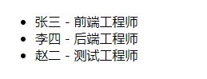

# 一、概述

[React Hooks >>](https://zh-hans.reactjs.org/docs/hooks-intro.html) 是 React 16.8 的新增特性。它可以让你在不编写 `class` 的情况下使用 `state` 以及其他的 React 特性。

```jsx
import { useState } from 'react';

export default function App() {
  // -- state
  const [count, setCount] = useState(0);
  // -- render
  return (
    <div>
      <p>You Click the Button {count} times.</p>
      <button type='button' onClick={() => setCount(count + 1)}>
        Tap me.
      </button>
    </div>
  );
}
```

`useState` 是我们要学习的第一个 “Hook”，这个例子是简单演示。如果不理解也不用担心。

## 动机

1）类组件状态逻辑复用难

- 缺少复用机制
- 渲染属性和高阶组件导致层级冗余

2）趋向复杂难以维护

- 生命周期函数混杂不相干逻辑
- 相干逻辑分散在不同生命周期

3）`this` 指向困扰

- 内联函数过度创新句柄
- 类成员函数不能保证this

## 优势

- 函数组件无 `this` 问题；
- 自定义Hook方便复用状态逻辑；
- 副作用的关注点分离；

## 渐进策略

**官方没有计划从 React 中移除 class**，所以，Hook 的使用完全是可选的。Hook 和现有代码可以同时工作，你可以渐进式地使用他们

## 使用规则

Hook 就是 JavaScript 函数，但是使用它们会有两个额外的规则：

- 只能在**函数最外层**调用 Hook。不要在循环、条件判断或者子函数中调用。
- 只能在 **React 的函数组件**中调用 Hook。不要在其他 JavaScript 函数中调用。（还有一个地方可以调用 Hook —— 就是自定义的 Hook 中，我们稍后会学习到。）

# 二、API

## [useState](https://zh-hans.reactjs.org/docs/hooks-reference.html#usestate)  

语法形式：

```jsx
const [state, setState] = useState(initialState);
```

- `state`：当前状态；
- `setState`：更新状态的函数，接收新值，替换旧值，加入渲染队列，统一重新渲染；
- `initialState`：初始值，只会在初始渲染时使用，可以是基本数据类型也可以是对象；

代码示例：

```jsx
import { useState } from 'react';

export default function App() {
  // -- state
  const [count, setCount] = useState(0);
  // -- render
  return (
    <div>
      <p>You Click the Button {count} times.</p>
      <button type='button' onClick={() => setCount(count + 1)}>
        Tap me.
      </button>
    </div>
  );
}
```

**1）函数式更新**

如果新的 state 需要通过使用先前的 state 计算得出，那么可以将函数传递给 `setState`。该函数将接收先前的 state，并返回一个更新后的值。

```jsx
<button onClick={() => setCount(prevCount => prevCount + 1)}>+</button>
```

如果你的更新函数返回值与当前 state 完全相同，则随后的重渲染会被完全跳过。

> 注意：
>
> 与 class 组件中的 `setState` 方法不同，`useState` 不会自动合并更新对象。你可以用函数式的 `setState` 结合展开运算符来达到合并更新对象的效果。
>
> ```jsx
> const [state, setState] = useState({});
> setState(prevState => {
>   // 也可以使用 Object.assign
>   return {...prevState, ...updatedValues};
> });
> ```

**2）惰性初始化**

`initialState` 参数只会在组件的初始渲染中起作用，后续渲染时会被忽略。如果初始 state 需要通过复杂计算获得，则可以传入一个函数，在函数中计算并返回初始的 state，此函数只在初始渲染时被调用：

```js
const [state, setState] = useState(() => {
  const initialState = someExpensiveComputation(props);
  return initialState;
});
```

## [useEffect](https://zh-hans.reactjs.org/docs/hooks-reference.html#useeffect) 

Effect Hook 可以让你在函数组件中执行副作用（数据获取，订阅或者手动修改DOM）操作。`useEffect` 就是一个 Effect Hook，它跟 class 组件中的 `componentDidMount`、`componentDidUpdate` 和 `componentWillUnmount` 具有相同的用途，只不过被合并成了一个 API。

例如，下面这个组件在 React 更新 DOM 后会设置一个页面标题：

```jsx
import { useState, useEffect } from 'react';

export default function App() {
  // -- state
  const [count, setCount] = useState(0);
  // -- effects
  // -- 相当于 componentDidMount 和 componentDidUpdate:
  useEffect(() => {
    document.title = `You clicked ${count} times`;
  });
  // -- render
  return (
    <div>
      <p>You Click the Button {count} times.</p>
      <button type='button' onClick={() => setCount(prevCount => prevCount + 1)}>Tap me.</button>
    </div>
  );
}
```

当你调用 `useEffect` 时，就是在告诉 React 在完成对 DOM 的更改后运行你的“副作用”函数。

由于副作用函数是在组件内声明的，所以它们可以访问到组件的 props 和 state。默认情况下，React 会在每次渲染后调用副作用函数 —— **包括**第一次渲染的时候。

**1）清除 effect**

副作用函数还可以通过返回一个函数来指定如何“清除”副作用，如：

```react
useEffect(() => {
  // -- 副作用操作（订阅、定时器...)
  return () => {
    // -- 清除副作用（移除订阅、定时器等操作...）
  };
});
```

**2）关注点分离**

React 允许使用多个 Effect 实现关注点分离。

```react
useEffect(() => {
  document.title = "Hello Hooks";
});
useEffect(() => {
  console.log(`count：${count}`);
});
```

**3）条件执行**

默认情况下，effect 会在每轮组件渲染完成后执行。这样的话，一旦 effect 的依赖发生变化，它就会被重新创建。

通过传递第2个参数（它是 effect 所依赖的值数组），可让其只在指定属性变化时重新创建。

```jsx
useEffect(() => {
  console.log(name);
}, [name]);
```

上述代码，会在 `name` 属性变化时才会触发 `effect`。

如果想执行  **只运行一次** 的 effect（仅在组件挂载和卸载时执行），可以传递一个空数组（`[]`）作为第二个参数。

```jsx
useEffect(() => {
  $.ajax(); 
  document.title = 'Hello-Hooks';
}, []);
```

## [useContext](https://zh-hans.reactjs.org/docs/hooks-reference.html#usecontext) 

```jsx
const value = useContext(AppContext);
```

接收一个 context 对象（`React.createContext` 的返回值）并返回该 context 的当前值。当前的 context 值由上层组件中距离当前组件最近的 `<AppContext.Provider>` 的 `value` prop 决定。

> **Tips：**
>
> 1）`useContext` 参数必须是 `context` 对象本身。
>
> 2）`useContext(AppContext)` 相当于 class 组件中的 `static contextType = AppContext` 或者 `<AppContext.Consumer>`。

请看示例：

*`./src/context.js`*

```js
import { createContext } from 'react';

const AppContext = createContext(null);

export default AppContext;
```

*`./src/app.js`*

```react
import Test from './components/Test';
import AppContext from './context';

function App() {
  return (
    <AppContext.Provider value={{ name: 'Li-HONGYAO', job: 'Front end engineer' }}>
      <div className='App'>
        <Test />
      </div>
    </AppContext.Provider>
  );
}

export default App;
```

*`./src/components/Test.js`*

```react
import * as React from 'react';
import AppContext from '../context';
export default function Test() {
  // -- context
  const { name, job } = React.useContext(AppContext);
  return (
    <div className='test'>
      {name} - {job}
    </div>
  );
}
```

## [useReducer](https://zh-hans.reactjs.org/docs/hooks-reference.html#usestate) 

语法形式：

```js
const [state, dispatch] = useReducer(reducer, initialArg, init);
```

参数解读：

- `reducer`：更新state，格式为：`(state, action) => newState`
- `initialArg`：初始 state
- `init`：惰性初始 state

代码示例：

```react
import * as React from 'react';

// -- state
const initialState = { count: 0 };
// -- reducer
const reducer = (state, action) => {
  switch (action.type) {
    case 'INCREMENT':
      return { count: state.count + 1 };
    case 'DECREMENT':
      return { count: state.count - 1 };
    default:
  }
};
// -- component
export default function Test() {
  const [state, dispatch] = React.useReducer(reducer, initialState);
  return (
    <div className='Test'>
      <p>Current Count：{state.count}</p>
      <button onClick={() => dispatch({ type: 'INCREMENT' })}>+</button>
      <button onClick={() => dispatch({ type: 'DECREMENT' })}>-</button>
    </div>
  );
}
```

**扩展功能**

useReducer，可以帮助我们集中式的处理复杂的 state 管理。但如果我们的页面很复杂，拆分成了多层多个组件，我们如何在子组件触发这些 state 变化呢？

我们可以结合 useContext 使用，将 dispatch 作为 <b><ins>value</ins></b> 属性传递给子组件即可。我们来看一组示例：

1）首先定义 store：*`src/store/index.js`*

```jsx
// -- initialState
export const initialState = {
  message: '众志成城，抗疫救灾',
  count: 0,
};

// -- reducer
export const reducer = (state = initialState, action) => {
  switch (action.type) {
    case 'INCREMENT':
      return { ...state, count: state.count + 1 };
    case 'DECREMENT':
      return { ...state, count: state.count - 1 };
    case 'UPDATE_MESSAGE':
      return { ...state, message: action.payload };
    default:
  }
};
```
2）创建一个Context上下文：*`src/context.js`*

```jsx
import { createContext } from 'react';

const AppContext = createContext(null);

export default AppContext;
```
3）在 *`App.js`*  中使用 useReducer，然后将 dispatch 通过上下文（context）共享给子组件

```react
import * as React from 'react';
import { initialState, reducer } from './store';
import AppContext from './context';
import Child from './components/Child';

export default function App() {
  // -- 解构state，dispatch
  const [state, dispatch] = React.useReducer(reducer, initialState);
  // -- 通过上下文将 state、dispatch 分发给子组件
  return (
    <AppContext.Provider value={{ state, dispatch }}>
      <div className='App'>
        <Child />
      </div>
    </AppContext.Provider>
  );
}
```
4）在子组件中通过 useContext 拿到 `state`、`dispatch` 使用

```react
import * as React from 'react';
import AppContext from '../context';
export default function Child() {
  // -- reducers
  const { state, dispatch } = React.useContext(AppContext);
  // -- render
  return (
    <div className='child'>
      {/* 读取状态 */}
      <p>count：{state.count}</p>
      <p>message：{state.message}</p>
      {/* 出发action更新数据 */}
      <button onClick={() => dispatch({ type: 'INCREMENT' })}>+1</button>
      <button onClick={() => dispatch({ type: 'DECREMENT' })}>-1</button>
      <input
        onInput={({ target: { value } }) => {
          dispatch({ type: 'UPDATE_MESSAGE', payload: value });
        }}
      />
    </div>
  );
}
```

## [useMemo](https://zh-hans.reactjs.org/docs/hooks-reference.html#usememo) & [useCallback](https://zh-hans.reactjs.org/docs/hooks-reference.html#usecallback) 

在介绍这些 hooks 的作用之前，我们先来回顾一下React 中的性能优化（避免组件内重渲染）：

- shouldComponentUpdate：对比nextProps 和 props决定要不要更新
- class 组件：pureComponent 
- Function组件：memo

示例代码：

```jsx
import * as React from 'react';

// -- 子组件
const Child = (props) => {
  // 父组件触发setCount方法，就会打印props
  console.log('child-props', props);
  return (
    <div>
      <input type='text' />
    </div>
  );
};

// -- 父组件
const Parent = () => {
  // -- state
  const [count, setCount] = React.useState(0);
  // -- render
  return (
    <div>
      <p>count: {count}</p>
      <button onClick={() => setCount(count + 1)}>+</button>
      <Child />
    </div>
  );
};

export default Parent;
```

**1）memo**

`memo` 的使用对象为组件，且一般为某组件内的子组件，以上述代码为例，使用 `memo` 函数将 `Child` 包裹住，可以避免重复渲染

```jsx
// -- 子组件
const Child = React.memo((props) => {
  // 父组件触发setCount方法，不会重复打印
  console.log('child-props', props);
  return (
    <div>
      <input type='text' />
    </div>
  );
});
```

**2）useCallback**

`memo` 缓存组件，`useCallback` 缓存函数，若把上述代码改为下面这样，则还会重复打印，此时的优化需有 `memo` 和 `useCallback` 配合使用
`Child` 子组件只使用了父组件中的方法，且方法是不变的，input change 时会调用父组件内的方法，handleChange 方法会多次挂载。

```react
import * as React from 'react';

// -- 子组件
const Child = React.memo((props) => { // 使用memo包裹优化
  console.log('child-props', props);
  return (
    <div>
      <input type='text' onChange={props.onChange} />
    </div>
  );
});

// -- 父组件
const Parent = () => {
  // -- state
  const [text, setText] = React.useState('');

  // -- events
  /*
  const hanleChange = ({ target: { value } }) => {
    setText(value);
  };*/
  // 优化写法
  const hanleChange = React.useCallback(({ target: { value } }) => {
    setText(value);
  }, []);

  // -- render
  return (
    <div>
      <p>text: {text}</p>
      <Child onChange={hanleChange} />
    </div>
  );
};

export default Parent;
```

**3）useMemo**

很多时候，我们需要在组件中计算数据，例如将数组组合到单个值，或者排序、过滤等。希望在其他状态发生变化时，不需要再重复 render。 `useMemo` 它与 `useCallback` 密切相关，但用于优化数据处理。它有相同的 API 来定义它所依赖的值。传入需要创建的函数和依赖项数组。 `useMemo` 只会在某个依赖项发生更改时重新计算 memoized 值。 此优化有助于避免在每个渲染上进行高开销的计算，如果没有提供依赖项数组，那么 `useMemo` 将会在每次渲染时重新计算新的值。

```jsx
onst memoizedValue = useMemo(() => computeExpensiveValue(a, b), [a, b]);
```

## [useRef](https://zh-hans.reactjs.org/docs/hooks-reference.html#useref) 

1）获取子组件或者DOM节点的句柄

2）渲染周期之间共享数据的存储

**1）useRef**

```jsx
const refContainer = useRef(initialValue);
```

`useRef` 返回一个可变的 ref 对象，其 `.current` 属性被初始化为传入的参数（`initialValue`）。返回的 ref 对象在组件的整个生命周期内持续存在。

```react
import * as React from 'react';

export default function App() {
  // -- refs
  const inputRef = React.useRef(null);
  // -- events
  const handleChange = () => {
    const v = inputRef.current.value;
    console.log(v);
  };
  return (
    <div className='App'>
      <input ref={inputRef} onInput={handleChange} />
    </div>
  );
}
```

**2）forwardRef**

如果上述示例中不是 `input` 标签，而是一个自定义组件应该如何处理呢？这个时候我们就需要使用到 `forwardRef` 啦。

```jsx
import * as React from 'react';

const Input = React.forwardRef((props, ref) => {
  return <input type='text' ref={ref} onInput={props.handleChange} />;
});

export default function App() {
  // -- refs
  const inputRef = React.useRef(null);
  // -- events
  const handleChange = () => {
    const v = inputRef.current.value;
    console.log(v);
  };
  return (
    <div className='App'>
      <Input ref={inputRef} handleChange={handleChange} />
    </div>
  );
}
```

可以看到 `React.forwardRef` 接受一个渲染函数，其接收 `props` 和 `ref` 参数并返回一个 React 节点。这样我们就将父组件中创建的`ref`转发进子组件，并赋值给子组件的 `input` 元素。

**3）数据共享**

我们刚刚讲到，useRef 可以实现渲染周期之间的共享数据的存储，我们来看如下示例：

```jsx
import * as React from 'react';
export default function App() {
  // -- state
  const [count, setCount] = React.useState(0);
  // -- refs
  const timerRef = React.useRef(null);

  // -- effects
  React.useEffect(() => {
    timerRef.current = setInterval(() => {
      setCount(count + 1);
    }, 1000);
  }, []);

  React.useEffect(() => {
    if (count === 5) {
      clearInterval(timerRef.current);
    }
  });

  return (
    <div className='App'>
      <p>Current count: {count}</p>
    </div>
  );
}
```

上面这个示例，我们使用useRef来记录timer，使得可以正常清除，试想一下，如果我们使用一个变量保存会怎样呢？显示不会正常清除，因为组件在每次渲染时都会重新复制timer变量。

## [useImperativeHandle](https://zh-hans.reactjs.org/docs/hooks-reference.html#useimperativehandle)

```jsx
useImperativeHandle(ref, createHandle, [deps])
```

`useImperativeHandle` 可以让你在使用 `ref` 时自定义暴露给父组件的实例值。在大多数情况下，应当避免使用 ref 这样的命令式代码。`useImperativeHandle` 应当与 [`forwardRef`](https://zh-hans.reactjs.org/docs/react-api.html#reactforwardref) 一起使用。

```jsx
import * as React from 'react';

const Child = React.forwardRef((props, ref) => {
  // -- refs
  const [value, setValue] = React.useState('');
  // -- 暴露方法或属性给父组件
  React.useImperativeHandle(
    ref,
    () => ({
      value,
      message: 'props in child.',
      sayHello: () => console.log('method in child.'),
    }),
    [value]
  );
  return (
    <div className='child'>
      <input onInput={({ target: { value } }) => setValue(value)} />
    </div>
  );
});

export default function App() {
  // -- refs
  const childRef = React.useRef(null);
  // -- events
  const handleClick = () => {
    // get props
    console.log(childRef.current.value);
    console.log(childRef.current.message);
    // get methods
    childRef.current.sayHello();
  };
  // -- render
  return (
    <div className='App'>
      <Child ref={childRef} />
      <button onClick={handleClick}>Reading</button>
    </div>
  );
}
```

## [useLayoutEffect](https://zh-hans.reactjs.org/docs/hooks-reference.html#uselayouteffect)

大部分情况下，使用 `useEffect` 就可以帮我们处理组件的副作用，但是如果想要同步调用一些副作用，比如对 DOM 的操作，就需要使用 `useLayoutEffect`，`useLayoutEffect` 中的副作用会在 DOM 更新之后同步执行。

尽可能使用标准的 `useEffect` 以避免阻塞视觉更新。

> 官方提示：
>
> 如果你正在将代码从 class 组件迁移到使用 Hook 的函数组件，则需要注意 `useLayoutEffect` 与 `componentDidMount`、`componentDidUpdate` 的调用阶段是一样的。但是，我们推荐你**一开始先用 `useEffect`**，只有当它出问题的时候再尝试使用 `useLayoutEffect`。

**useLayoutEffect + useCllback**

我们知道：

`React.memo` 类似于 `React.PureComponent`，能对`props`做浅比较，防止组件无效的重复渲染。

`useCallback` 用于缓存 `inline` 函数，防止因属性更新时生成新的函数导致子组件重复渲染。

父组件中input值发生变化时，会导致Child重新render，使用`React.memo`可以可以解决。

```react
const Child = React.memo(() => {
    console.log("child") //只打印一次
    return (
        <div>
            <button >submit</button>
        </div>
    )
})
```

但是当Child组件接收父组件中的`onSubmit`函数，即使用了`React.memo`同样导致child重新渲染，

```jsx
const Child = React.memo(({ onSubmit }) => {
    console.log("child") //input变化时就打印
    return (
        <div>
            <button onClick={onSubmit}>submit</button>
        </div>
    )
})
```

因为input变化后，生成了新的`onSubmit`,`React.memo`认为是不同的`onSubmiit`，所以更新了
这时候，就要用到`useCallback`了。

```jsx
import React from "react"

const Child = React.memo(({ onSubmit }) => {
    console.log("child")
    return (
        <div>
            <button onClick={onSubmit}>submit</button>
        </div>
    )
})

const App = () => {
    const [text, setText] = React.useState("")

    // 方案一
    const onSubmit1 = React.useCallback(() => {
        console.log(text)
    }, []) //text是初始值，没有更新

    // 方案二
    const onSubmit2 = React.useCallback(() => {
        console.log(text)
    }) //text是新的，text变化时，生成了新的onSubmit2,表示只要有属性更新就执行

    // 方案三，等同于方案二
    const onSubmit3 = React.useCallback(() => {
        console.log(text)
    }, [text]) //text是新的，text变化时，生成了新的onSubmit2,表示text更新时执行

    // 方案四，达到了目的
    const ref = React.useRef()
    React.useLayoutEffect(() => {
        ref.current = text
    }, [text])
    const onSubmit4 = React.useCallback(() => {
        console.log(ref.current)
    }, [ref]) //ref只在创建时更新，其属性current跟随text变化，不会生成新的onSubmit4

    console.log("app")
    return (
        <div>
            <input value={text} onChange={e => setText(e.target.value)} />
            {/* Child组件使用了React.memo */}
            <Child onSubmit={onSubmit4} />
        </div>
    )
}

export default App

```

useCallback与memo搭配使用才能达到最优效果

# 三、自定义Hook

目前为止，在 React 中有两种流行的方式来共享组件之间的状态逻辑: [render props](https://zh-hans.reactjs.org/docs/render-props.html) 和 [高阶组件](https://zh-hans.reactjs.org/docs/higher-order-components.html)，现在让我们来看看 Hook 是如何在让你不增加组件的情况下解决相同问题的。

通过自定义 Hook，可以将组件逻辑提取到可重用的函数中。

*`src/hooks/useList.js`*

```react
import * as React from 'react';

export default function useList() {
  // -- state
  const [list, setList] = React.useState(null);
  // -- effects
  React.useEffect(() => {
    req().then((r) => {
      setList(r.data);
    });
  }, []);
  return {
    list,
  };
}

function req() {
  return new Promise((resolve, reject) => {
    setTimeout(() => {
      resolve({
        code: 0,
        data: [
          { id: 1, name: '张三', job: '前端工程师' },
          { id: 2, name: '李四', job: '后端工程师' },
          { id: 3, name: '赵二', job: '测试工程师' },
        ],
      });
    }, 1000);
  });
}
```

*`src/app.jsx`*

```jsx
import * as React from 'react';
import useList from './hooks/useList';

export default function App() {
  // -- hooks
  const { list } = useList();

  return (
    <div className='App'>
      {list ? (
        <ul>
          {list.map((item) => (
            <li key={item.id}>
              {item.name} - {item.job}
            </li>
          ))}
        </ul>
      ) : (
        'loading...'
      )}
    </div>
  );
}
```

效果演示：



# 四、React Hooks 数据流

[参考这里 >>](https://juejin.im/post/5e8bd87851882573c66cfc68#heading-6)


