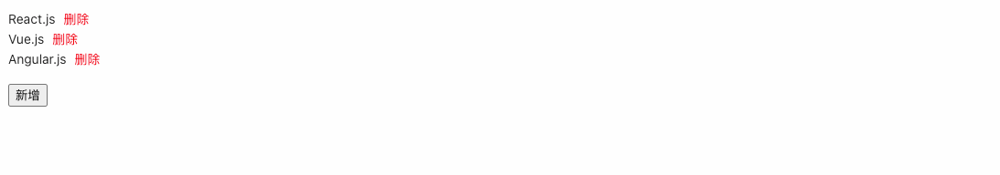

1. [React Transition Group](https://reactcommunity.org/react-transition-group/)
2. [Ant Motion](https://motion.ant.design/index-cn)
3. [Animate.css](https://animate.style/)

# 契子

在React中，要实现过渡动效可以通过 Ant Motion 或 React Transition Group 实现，本文主要讲解 React Transition Group 的基本使用。 据官网介绍，React Transition Group 库暴露了几个用于定义进入和退出转换的简单组件。React Transition Group 不像 React Motion 那样是一个动画库，它本身不为样式设置动画。相反，它公开了转换阶段，管理类和一组元素，并以有用的方式操纵DOM，使实际视觉转换的实现更加容易。

# 安装

```shell
$ yarn add react-transition-group animate.css
$ yarn add @types/react-transition-group -D
```

# 组件

React Transition Group 提供如下4个组件定义进入和退出转换，具体的介绍可点击下方链接查看。

## [Transition](https://reactcommunity.org/react-transition-group/transition)

Transition 组件允许您使用一个简单的声明性API描述一段时间内从一个组件状态到另一个组件状态的转换。最常见的是，它用于为组件的安装和卸载设置动画，但也可以用于描述就地过渡状态。

> 注意：Transition 是一个平台无关的基本组件。如果你在CSS中使用转换，你可能会想使用 CSSTransition。它继承了 Transition 的所有特性，但包含了更好地处理CSS转换所需的其他特性（因此组件被命名为 CSSTransition）

默认情况下，Transition 组件不会改变它呈现的组件的行为，它只跟踪组件动画的 `进入` 和 `退出` 状态，由开发者来赋予这些状态的实际意义和展现效果

### API

语法形式：

```tsx
<Transition nodeRef={nodeRef} in={inProp} timeout={150}>
  {state => (
    <MyComponent ref={nodeRef} className={`fade fade-${state}`} />
  )}
</Transition>
```

- `children`：Transition 子节点是一个函数，该函数接收当前动画的转换状态，返回页面实际需要渲染的子组件。

  转换状态主要分两类：

  - 进入状态：
    - entering：进入状态/展示中
    - entered：进入状态/最终态
  - 离开状态：
    - exiting：退出状态/展示中
    - exited：退出状态/最终态

- `nodeRef`：一个需要转换的DOM元素的React引用（可选）。

- `in`：动画触发的状态，为 `true` 时触发 进入动画，为 `false` 时触发 离开动画。

- `appear`：默认情况下，子组件在第一次挂载时，不管 in 的值为什么，组件都不会触发 进入动画，如果想要子组件展示类似 入场动画 的效果，需要将 appear 与 in 都设置为 true（可选）。

- `timeout`：动画的持续时间，单位为毫秒，可以一次设置所有状态的动画时间，也可以单独设置每个状态的动画时间。

  ```ts
  timeout={ 500 }
  // or
  timeout={ appear: 500, enter: 300, exit: 500 }

- `addEndListener`：自定义 transition 结束的触发器，它允许开发者自定义更加细腻的动画结束逻辑，其接收动画中的 dom 节点和一个动画结束的回调函数。

  ```ts
  addEndListener={(node, done) => {
    // use the css transitionend event to mark the finish of a transition
    node.addEventListener('transitionend', done, false);
  }}
  ```

- 各个动画阶段的钩子：

  ① 开始动画的三个钩子，均接收一个回调函数 `Function(node: HtmlElement, isAppearing: bool) => void`，回调函数接收 2 个参数，第一个参数为当前元素的 dom 节点，第二个参数表示当前动画是否为元素初次挂载时发生。

  - `onEnter`：在动画状态变为 entering 之前调用

  - `onEntering`：在动画状态变为 entering 之后调用

  - `onEntered`：在动画状态变为 entered 之后调用

  ② 离开动画的三个钩子，均接收一个回调函数 `Function(node: HtmlElement) => void`，回调函数仅接收当前元素的 dom 节点。

  - `onExit`：在动画状态变为 exiting 之前调用

  - `onExiting`：在动画状态变为 exiting 之后调用

  - `onExited`：在动画状态变为 exited 之后调用Ï

### 示例


```tsx
import React, { useRef, useState } from 'react';
import { Transition } from 'react-transition-group';
import './index.less';

const Test: React.FC = () => {
  const [inProp, setInProp] = useState(true);
  const nodeRef = useRef(null);
  return (
    <div>
      <Transition nodeRef={nodeRef} appear={true} in={inProp} timeout={500}>
        {(state: string) => (
          <div ref={nodeRef} className={`fade fade-${state}`}>
            I'm a fade Transition!
          </div>
        )}
      </Transition>
      <button onClick={() => setInProp((prev) => !prev)}>Toggle</button>
    </div>
  );
};
export default Test;
```

```less
.fade {
  transition: opacity 300ms ease-in-out;
  opacity: 0;
  &-entering,
  &-entered {
    opacity: 1;
  }

  &-exiting,
  &-exited {
    opacity: 0;
  }
}
```

## [CSSTransition](https://reactcommunity.org/react-transition-group/css-transition)

该组件继承自 Transition 组件，继承了 Transition 的所有 API，CSSTransition 组件在 Transition 提供的 开始动画 和 退出动画 的基础上，增加了 入场动画，支持更加细分的动画的各个阶段，以开始动画为例，CSSTransition 会在其子组件的 class 上依次添加：`*-enter`，`*-enter-active`，`*-enter-done`，其中：

- `enter`：标识开始动画的初始阶段。
- `enter-active`：标识开始动画的激活阶段
- `enter-done`：标识开始动画的结束阶段，也就是最终状态。

### API

CSSTransition 新增的API就是 `classNames`，有两种使用方法，一种是提供一个统一的前缀字符串，它会自动给每个阶段的 class 名称加上这个前缀，另一种是提供一个对象，自己定义每个阶段的 class 名称：

```tsx
classNames="my"

// or

classNames={{
 appear: 'my-appear',
 appearActive: 'my-active-appear',
 appearDone: 'my-done-appear',
            
 enter: 'my-enter',
 enterActive: 'my-active-enter',
 enterDone: 'my-done-enter',
            
 exit: 'my-exit',
 exitActive: 'my-active-exit',
 exitDone: 'my-done-exit',
}}

```

### 示例


```tsx
import 'animate.css';
import React, { useRef, useState } from 'react';
import { CSSTransition } from 'react-transition-group';

const Test: React.FC = () => {
  const [inProp, setInProp] = useState(true);
  const nodeRef = useRef(null);
  return (
    <div>
      <CSSTransition
        nodeRef={nodeRef}
        in={inProp}
        timeout={500}
        unmountOnExit
        classNames={{
          enter: 'animate__animated animate__fadeInRight',
          exit: 'animate__animated animate__fadeOutRight',
        }}
      >
        <div ref={nodeRef}>I'm a fade Transition!</div>
      </CSSTransition>
      <button onClick={() => setInProp((prev) => !prev)}>Toggle</button>
    </div>
  );
};
export default Test;

```

## [SwitchTransition](https://reactcommunity.org/react-transition-group/switch-transition)

SwitchTransition 组件是受 vue 过渡模式的启发而诞生的，也是继承自 Transition 组件，当我们想要控制状态转换之间的渲染时，就可以使用 SwitchTransition，SwitchTransition 需要使用 Transition 或 CSSTransition 包裹需要渲染到页面的组件，来当做它的 Children。

### API

```tsx
<SwitchTransition>
  <CSSTransition
    key={state}
    addEndListener={
      (node, doneCallBack) => 
      	node.addEventListener("transitionend", doneCallBack)
    }
    classNames='my'
    >
    <MyComponent />
  </CSSTransition>
</SwitchTransition>

```

SwitchTransition 新增的API：

- `mode`：
  - `out-in`：表示 SwitchTransition 需要等待 old child 离开，然后插入 new child
  - `in-out`：表示 SwitchTransition 需要等待插入 new child，然后移除 old child

### 示例


```tsx
import 'animate.css';
import React, { createRef, useState } from 'react';
import { CSSTransition, SwitchTransition } from 'react-transition-group';
const Test: React.FC = () => {
  const nodeRef = createRef<HTMLDivElement>();
  const [state, setState] = useState(false);

  return (
    <div>
      <SwitchTransition mode={'out-in'}>
        <CSSTransition
          key={String(state)}
          classNames={{
            enter: 'animate__animated animate__fadeInRight',
            exit: 'animate__animated animate__fadeOutRight',
          }}
          timeout={500}
        >
          <div ref={nodeRef}>
            <button onClick={() => setState((state) => !state)}>
              {state ? 'Hello, world!' : 'Goodbye, world!'}
            </button>
          </div>
        </CSSTransition>
      </SwitchTransition>
    </div>
  );
};
export default Test;

```


## [TransitionGroup](https://reactcommunity.org/react-transition-group/transition-group)

顾名思义，TransitionGroup 是来管理多个元素的动画效果，上面介绍的组件都是控制单个元素的动画效果，TransitionGroup 就像是一个状态机，可以管理子组件的挂载状态和卸载状态的动画。

### API

```tsx
<TransitionGroup>
  {list.map(({ id }) => (
    <CSSTransition
      key={id}
      timeout={500}
      classNames="my"
    >
      <MyComponent key={id}/>
    </CSSTransition>
  ))}
</TransitionGroup>

```

TransitionGroup 新增的 API：

- `component`：在默认情况下，TransitionGroup 会被渲染为一个 div，如果想要避免这样的行为，可以传入 null。
- `appear`：控制子组件是否展示 入场动画，默认为 true，它接收的值会覆盖掉子组件上对应的设置。
- `enter`：控制子组件是否展示 开始动画，默认为 true，它接收的值会覆盖掉子组件上对应的设置。
- `exit`：控制子组件是否展示 结束动画，默认为 true，它接收的值会覆盖掉子组件上对应的设置。

### 示例



```tsx
import 'animate.css';
import React, { createRef, useState } from 'react';
import { CSSTransition, TransitionGroup } from 'react-transition-group';

const Test: React.FC = () => {
  const uuid = () => Math.random().toString(32).slice(2);
  const [items, setItems] = useState([
    { id: uuid(), text: 'React.js', nodeRef: createRef<HTMLDivElement>() },
    { id: uuid(), text: 'Vue.js', nodeRef: createRef<HTMLDivElement>() },
    { id: uuid(), text: 'Angular.js', nodeRef: createRef<HTMLDivElement>() },
  ]);
  const onInsert = () => {
    setItems((items) => [
      ...items,
      {
        id: uuid(),
        text: `NEW ${items.length + 1}`,
        nodeRef: createRef<HTMLDivElement>(),
      },
    ]);
  };
  const onDel = (id: string) => {
    setItems((items) => items.filter((item) => item.id !== id));
  };
  return (
    <div>
      <TransitionGroup>
        {items.map(({ id, text, nodeRef }, index) => (
          <CSSTransition
            key={id}
            classNames={{
              enter: 'animate__animated animate__fadeInRight',
              exit: 'animate__animated animate__fadeOutRight',
            }}
            nodeRef={nodeRef}
            timeout={500}
          >
            <div ref={nodeRef}>
              <span>{text}</span>
              <a
                style={{ marginLeft: 9, color: 'red' }}
                onClick={() => onDel(id)}
              >
                删除
              </a>
            </div>
          </CSSTransition>
        ))}
      </TransitionGroup>
      <button style={{ marginTop: 16 }} onClick={onInsert}>
        新增
      </button>
    </div>
  );
};
export default Test;

```

# 参考

「1」精神病患者link常.简书.[React:动画-react-transition-group、animate.css](https://www.jianshu.com/p/57ce1835415c)

「2」青藤前端团队.稀土掘金.[5 分钟精通 react-transition-group](https://juejin.cn/post/7030727850357424165)


[精神病患者link常](https://www.jianshu.com/u/e937e374c41a)