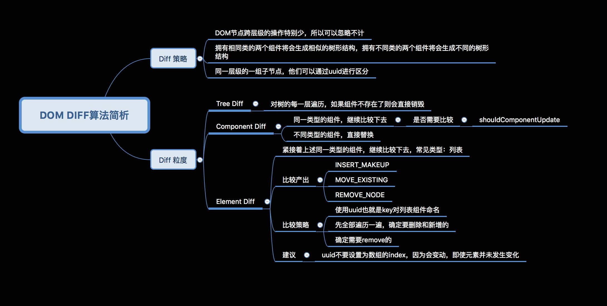

# # 常见面试题

## 1. 在哪里做性能优化？

<b style="color:red;"><ins>shouldComponentUpdate</ins></b> /=> 这个方法用来判断是否需要调用 render 方法重绘 dom。因为 dom 的描绘非常消耗性能，如果我们能在这个方法中能够写出更优化的 dom diff 算法，可以极大的提高性能。

## 2. React diff 原理？

- 把树形结构按照层级分解，只比较同级元素。
- 通过给列表结构的每个单元添加的唯一 key值进行区分同层次子节点的比较。
- React 只会匹配相同 组件名 的 component 
- 合并操作 => 调用 component 的 setState 方法的时候，React 将其标记为 dirty，到每一个事件循环结束，React 检查所有标记 dirty 的 component 重新绘制。
- 选择性渲染 => 开发人员可以重写 shouldComponentUpdate 提高 diff 的性能。



[DOM Diff 算法解析 >>](https://blog.csdn.net/one_girl/article/details/81086289)

## 3. 虚拟DOM 原理？

1. 用 js对象结构表示 DOM 树的结构，然后用这个树构建一个真正的 DOM 树，插到文档当中。
2. 当状态变更的时候，重新构造一棵新的对象树。然后对比新旧虚拟DOM树，记录两棵树差异。
3. 把 2 所记录的差异应用到步骤 1 所构建的真正的 DOM 树上，视图就更新了。

## 4. 为什么虚拟DOM会提高性能？

虚拟 dom 相当于在 js 和真实 dom 中间加了一个缓存，利用 dom diff 算法避免了没有必要的 dom 操作，从而提高性能。

## 5. React 中 refs 的作用是什么？

Refs 是 React 提供给我们的**安全访问** DOM 元素或者某个组件实例的句柄。通过它我们可以从虚拟dom中拿出真实dom。我们可以为元素添加 ref 属性然后在回调函数中接受该元素在 DOM 树中的句柄，该值会作为回调函数的第一个参数返回。比如：

```react
<input ref={(input) => this.input = input}  />
// => 通过 this.input.value 取值
<input ref="name" />
// => 通过 this.refs.name 取值
```

> 提示：refs 并不是类组件的专属，函数式组件同样能够利用闭包暂存其值

## 6. React 中的keys有何作用？

- Keys 是 React 用于追踪哪些列表中元素被修改、被添加或者被移除的辅助标识。
- 在开发过程中，我们需要保证某个元素的 key 在其同级元素中具有唯一性。
  - 在 React Diff 算法中 React 会借助元素的 Key 值来判断该元素是新近创建的还是被移动而来的元素，从而减少不必要的元素重渲染。
  - 此外，React 还需要借助 Key 值来判断元素与本地状态的关联关系，因此我们绝不可忽视转换函数中 Key 的重要性。

## 7. setState 为什么是异步的？

>  参考链接：[React 中 setState() 为什么是异步的？](https://segmentfault.com/a/1190000013040438)、 [react的setstate原理](https://www.jianshu.com/p/89a04c132270)

- 保证内部的一致性：因为props是要等到父组件渲染过后才能拿到，也就是不能同步更新，state出于统一性设成异步更新。
- 性能优化：举例说你正在一个聊天窗口输入，如果来了一条新消息又要render,那就会阻塞你的当前操作，导致延迟什么的。
- 支持state在幕后渲染：异步可以使state在幕后更新，而不影响你当前旧的页面的交互，提升用户体验。


